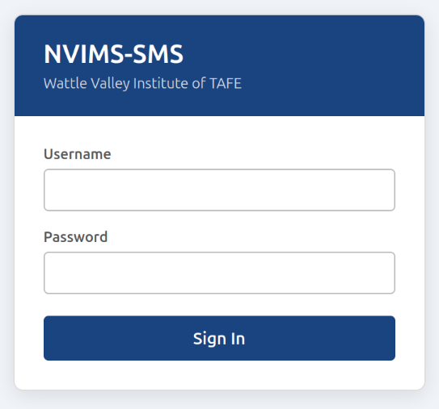
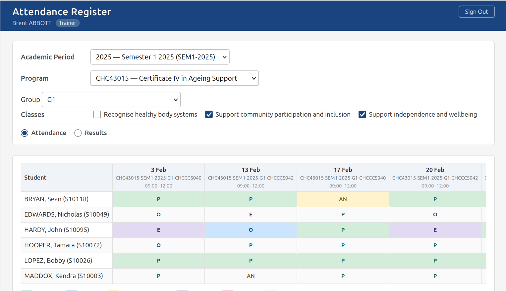
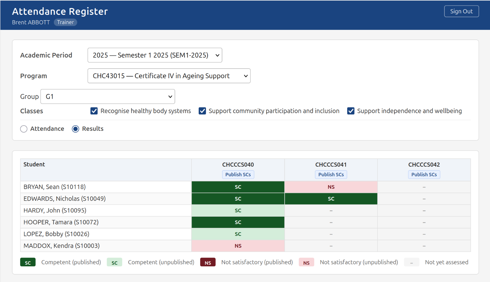

# NVIMS-SMS
A National VET Information Management System (NVIMS), Student Management System (SMS) component implemented in PostgreSQL and Go, featuring teacher workload tracking, class scheduling, timetabling, attendance management, and multi‑cohort support for TAFEs, RTOs, and Higher Education providers across Australia. Not AVETMISS compliant yet.

## Development
This is currently in an early development stage. It is not yet highly functional.

Project commencement: 05 June 2026.  
Costs to date: $34.00.  

## Testing

Setup a Postgre server, create a database called nvims-sms then:  

CREATE USER nvims WITH PASSWORD 'jjnhbFC56RDWRTJHBjhb98uibe';  
ALTER DATABASE "nvims-sms" OWNER TO nvims;  
GRANT ALL PRIVILEGES ON DATABASE "nvims-sms" TO nvims;  
GRANT ALL PRIVILEGES ON ALL TABLES IN SCHEMA public TO nvims;  
GRANT ALL PRIVILEGES ON ALL SEQUENCES IN SCHEMA public TO nvims;  
GRANT ALL PRIVILEGES ON ALL FUNCTIONS IN SCHEMA public TO nvims;  

Run the seed.py script to put synthetic data into the database.  
Run: go run ./cmd/server from the src directory.  

See also [Database Schema Documentation](https://github.com/harleycalvert/nvims-sms/blob/main/docs/DATABASE.md)

[NVIMS Forum](https://nvims.boards.net/)
