# A National VET Information Management System (NVIMS), Student Management System (SMS) — Database Design

PostgreSQL schema for a national, potentially AVETMISS-compliant Student Management System (SMS)
supporting both VET and Higher Education delivery for TAFEs and RTOs. This document
describes the design of `v0.13`: its entities, relationships, business rules, and the
mapping to the AVETMISS NAT reporting files.

> **Status:** design schema. Reference data (SACC countries, ASCL languages, full
> classification sets) is only partially seeded; see [Caveats](#caveats--not-yet-modelled).

---

## Contents

- [Scope](#scope)
- [Design principles](#design-principles)
- [Domain map](#domain-map)
- [Entity-relationship diagrams](#entity-relationship-diagrams)
  - [1. Identity](#1-identity)
  - [2. Curriculum](#2-curriculum)
  - [3. Enrolment](#3-enrolment)
  - [4. RTO infrastructure](#4-rto-infrastructure)
  - [5. Timetabling](#5-timetabling)
  - [6. Holidays](#6-holidays)
  - [7. Communications](#7-communications)
  - [8. Completions, compliance & audit](#8-completions-compliance--audit)
  - [9. Workplan](#9-workplan)
  - [10. Timesheet](#10-timesheet)
- [Table reference](#table-reference)
- [Data dictionary](#data-dictionary)
- [AVETMISS NAT file mapping](#avetmiss-nat-file-mapping)
- [Business rules & constraints](#business-rules--constraints)
- [Functions & triggers](#functions--triggers)
- [Notes for application developers](#notes-for-application-developers)
- [Caveats & not-yet-modelled](#caveats--not-yet-modelled)

---

## Scope

The schema covers the full SMS lifecycle:

- **People & identity** — students, teachers, support staff, guardians, system users.
- **Curriculum** — qualifications/courses (programs) and units/modules/subjects.
- **Enrolment** — at both program level and subject level, including standalone units.
- **Extensions** — apprenticeships, traineeships, training plans, Learning Access Plans
  (LAPs), VET Student Loans, Higher Education unit details, RPL/credit transfer.
- **Timetabling** — recurring class templates, concrete sessions, attendance, room and
  teacher double-booking prevention, and configurable per-teacher teaching hour caps
  (annual and optionally per-academic-period for HE/DUAL-sector teachers).
- **Public holidays** — recurrence rules expanded into concrete observances.
- **Communications** — email/SMS campaigns and per-recipient delivery logs.
- **Compliance** — AVETMISS NAT export sources, program completions, and an audit trail.
- **Workplan** — annual teacher workplan per VTSA 2024 clause 32.4: Teaching Delivery,
  CAPPS, and Education-Related Duties allocations with an approval workflow.
- **Timesheet** — fortnightly (or other pay-period) hour records auto-populated from
  sessions; submitted for external payroll processing (hours only, no banking or super
  data).

---

## Design principles

| Principle | How it shows up |
|---|---|
| **Surrogate keys everywhere** | Every operational table uses `BIGSERIAL` surrogate PKs; natural keys (USI, student number, AVETMISS codes) are enforced as `UNIQUE`. |
| **Shared-primary-key subtyping** | `people` owns identity. `students`, `teachers`, `staff` each have `id` that is *both* their PK *and* a FK to `people(id)`. A row's identity **is** its person, and one person may hold multiple roles. |
| **Sessions are the source of truth** | Teaching hours, attendance, and the per-teacher cap enforcement are all derived from concrete `class_sessions` + `session_teachers`, never from the recurring `class_slots` template. |
| **Definition vs occurrence** | Recurring concepts are stored once as rules and expanded into dated rows: `holiday_rules` → `holiday_observances`; `class_slots` → `class_sessions`. |
| **Compliance data is never hard-deleted** | Core records use soft-delete (`deleted_at`/`deleted_by`) and the enrolment chain uses `ON DELETE RESTRICT` so reportable history can't be cascaded away. |
| **Invariants enforced in the database** | Exclusion constraints, `CHECK`s, and `num_nonnulls()` keep the data correct regardless of which client wrote it, so the application layer can stay simple. |

---

## Domain map

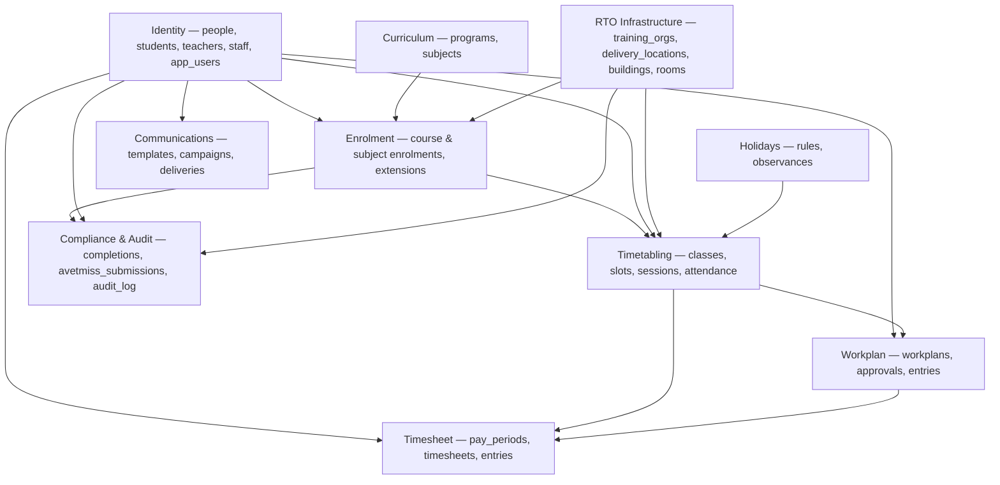

---

## Entity-relationship diagrams

Diagrams are split by domain for readability. `||--o{` = one-to-many, `||--o|` = one-to-(zero-or-one), `}o--o{` = many-to-many (via a join table).

### 1. Identity

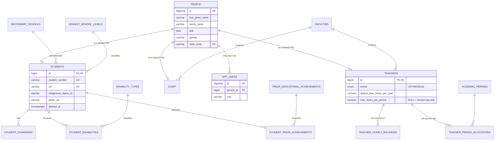

### 2. Curriculum

```mermaid
erDiagram
    FACULTIES ||--o{ PROGRAMS : owns
    PROGRAMS }o--o{ SUBJECTS : "packaged via SUBJECT_PROGRAMS"
    SUBJECT_PROGRAMS }o--|| PROGRAMS : ""
    SUBJECT_PROGRAMS }o--|| SUBJECTS : ""

    PROGRAMS {
        bigserial id PK
        varchar program_code UK
        varchar level_of_education
        varchar field_of_education
        boolean vet_flag
        boolean he_flag
        integer credit_points "total qualification cp (HE)"
        smallint aqf_level "1-10, nullable"
    }
    SUBJECTS {
        bigserial id PK
        varchar subject_code UK
        varchar field_of_education
        integer nominal_hours
        boolean vet_flag
        integer credit_points "HE unit credit points, nullable"
    }
```

### 3. Enrolment

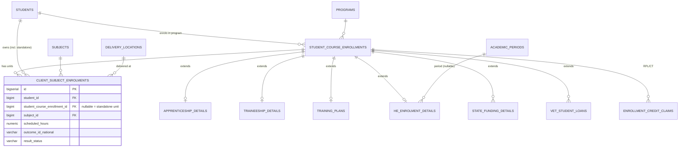

### 4. RTO infrastructure

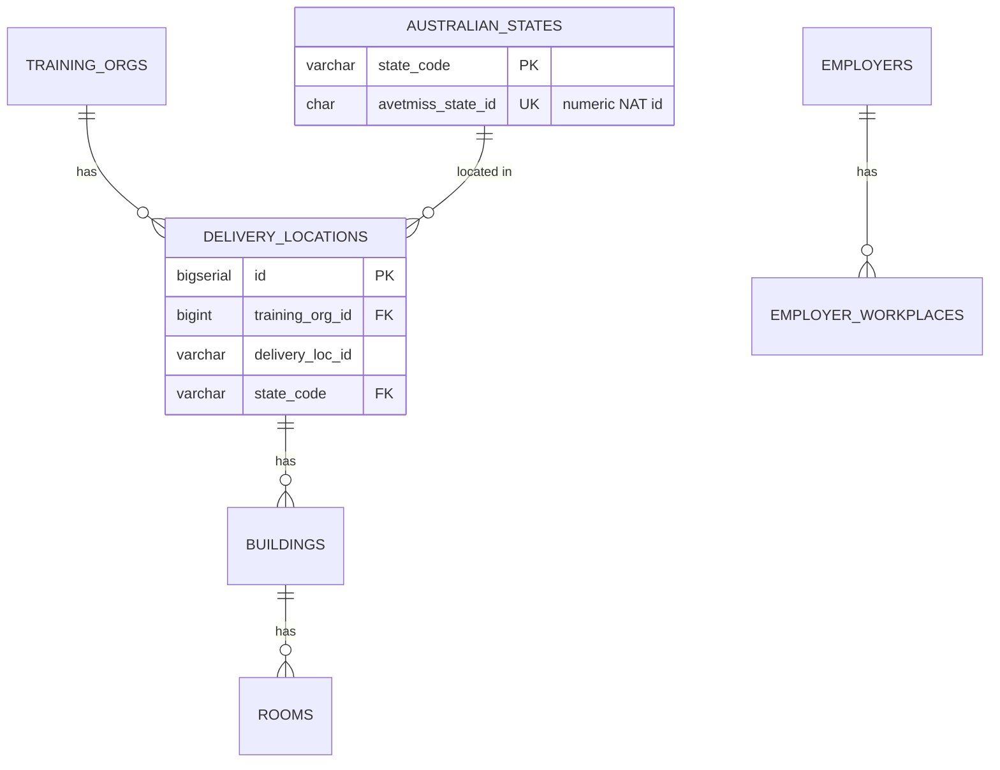

### 5. Timetabling

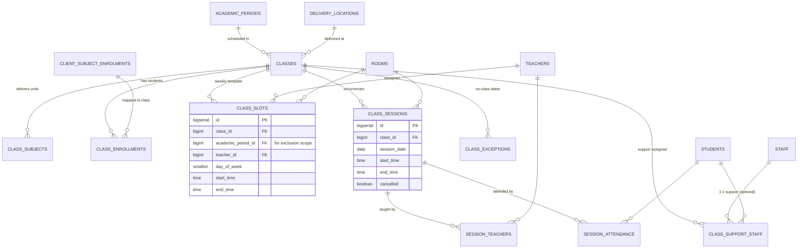

### 6. Holidays

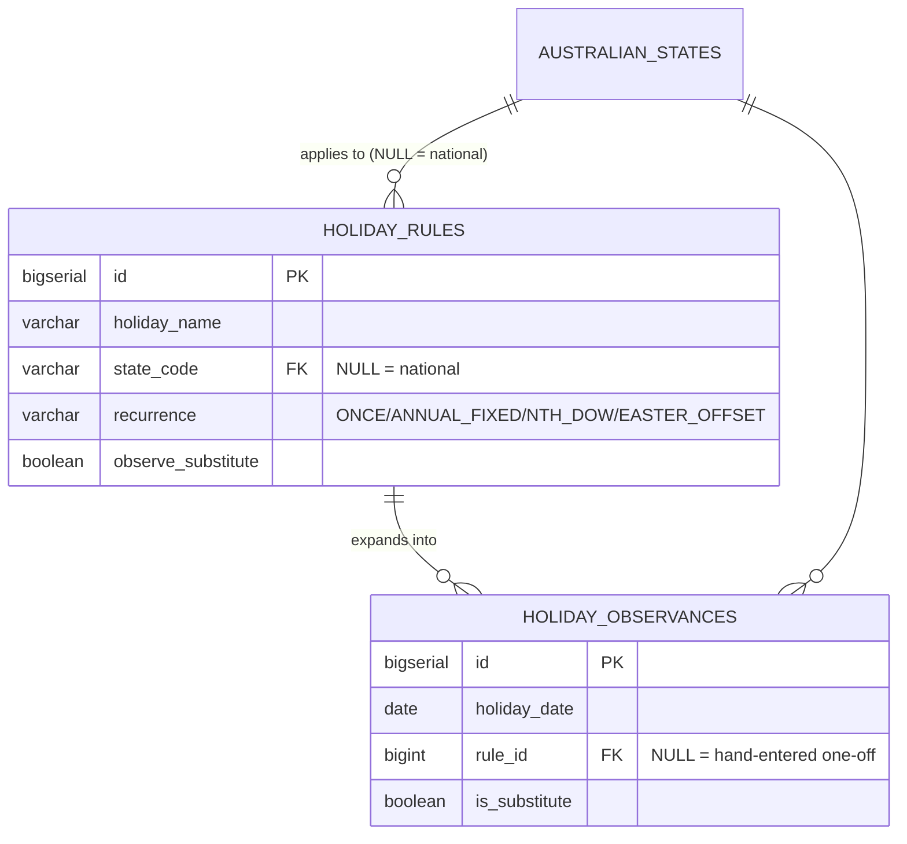

### 7. Communications

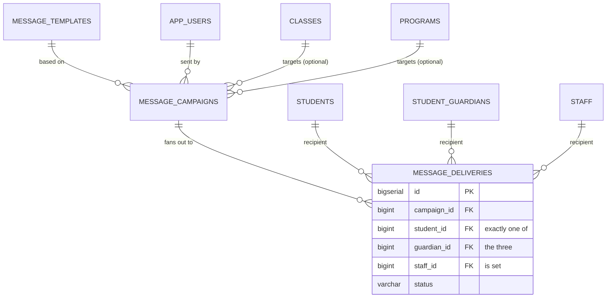

### 8. Completions, compliance & audit

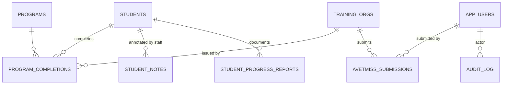

### 9. Workplan

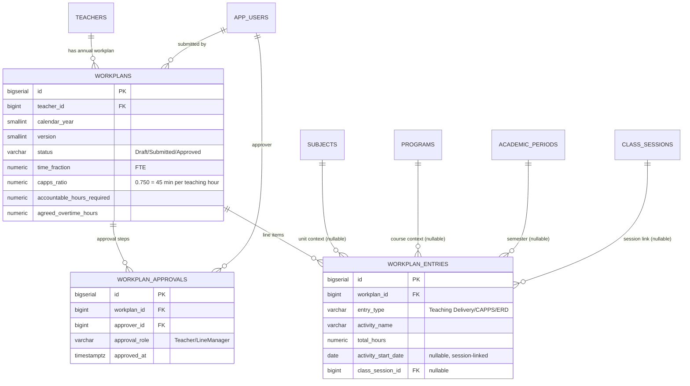

### 10. Timesheet

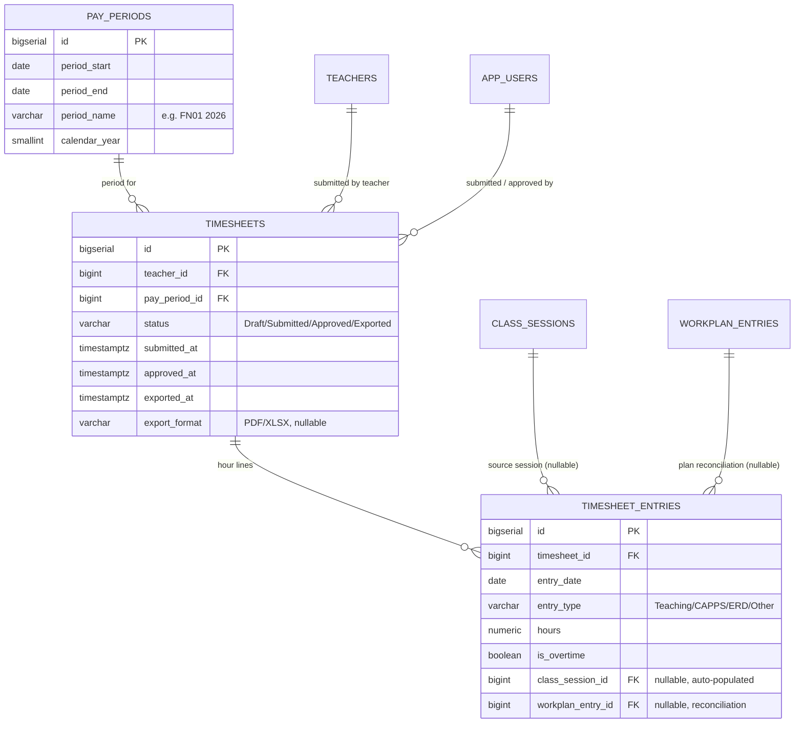

---

## Table reference

Tables are grouped by domain. "Key relationships" lists the most important foreign keys.

### Identity & reference

| Table | Purpose | Key relationships |
|---|---|---|
| `people` | Single identity spine — name, DOB, gender, address, contact. Owns the surrogate id. | → `australian_states` |
| `students` | Student-specific data: student number, USI, AVETMISS demographics, photo, ID expiry. Shares PK with `people`. Soft-deletable. | PK = FK → `people`; → `secondary_schools`, `highest_school_levels` |
| `teachers` | Teacher-specific data: sector (`VET`/`HE`/`DUAL`), annual hours cap, and optional per-period cap. Shares PK with `people`. | PK = FK → `people`; → `faculties` |
| `staff` | Support/admin staff. Shares PK with `people`. | PK = FK → `people`; → `faculties` |
| `app_users` | Login/system accounts and RBAC role. Source of every `*_by` audit actor. | → `people` (nullable, for service accounts) |
| `teacher_yearly_balances` | Maintained cache of booked teaching hours per teacher per calendar year. Cap seeded from `teachers.default_max_hours_per_year`; overridable per-year. | → `teachers` |
| `teacher_period_allocations` | Per-academic-period hour cap and running total for HE/DUAL teachers with `max_hours_per_period` set. Auto-created on first session booking. | → `teachers`, `academic_periods` |
| `student_guardians` | Guardians/emergency contacts; comms targets for under-18s. | → `students` |
| `student_disabilities` | Declared disabilities (NAT00090). | → `students`, `disability_types` |
| `student_prior_achievements` | Prior educational achievement (NAT00100). | → `students`, `prior_educational_achievements` |
| `australian_states` | State/territory reference, incl. the **numeric AVETMISS state id**. | — |
| `disability_types`, `prior_educational_achievements`, `highest_school_levels`, `secondary_schools`, `faculties` | Classification & org reference data. | — |

### Curriculum

| Table | Purpose | Key relationships |
|---|---|---|
| `programs` | Qualifications/courses (NAT00030). `he_flag` distinguishes HE qualifications. `credit_points` is the total qualification credit point value; `aqf_level` (1–10) applies to both VET and HE. | → `faculties` |
| `subjects` | Units/modules/subjects (NAT00060). `credit_points` holds the HE unit credit point value (NULL for VET-only units). | — |
| `subject_programs` | Which subjects belong to which programs (many-to-many). | → `subjects`, `programs` |

### Enrolment & extensions

| Table | Purpose | Key relationships |
|---|---|---|
| `student_course_enrollments` | Program-level enrolment; commencement/completion, funding state. Soft-deletable. | → `students`, `programs` |
| `client_subject_enrolments` | Subject-level training activity (NAT00120). `student_course_enrollment_id` is **nullable** to allow standalone unit enrolments. Holds the draft/finalised result workflow. | → `students`, `subjects`, `student_course_enrollments`, `delivery_locations` |
| `apprenticeship_details` | Apprenticeship contract, employer, AASN, training-plan milestones (1:1). | → `student_course_enrollments`, `employers`, `employer_workplaces`, `aasn_providers` |
| `traineeship_details` | Traineeship probation/extension data (1:1). | → `student_course_enrollments` |
| `training_plans` | Training-plan signing/review dates (1:1). | → `student_course_enrollments` |
| `learning_access_plans` | LAP: adjustments and resources for students with disabilities. | → `students`, `student_course_enrollments`, `staff` (assessor) |
| `vet_student_loans` | VSL/VET-FEE-HELP per census date (1:many). | → `student_course_enrollments` |
| `he_enrolment_details` | Higher-Ed EFTSL/census/HELP details (1:1). `academic_period_id` links to the specific semester/trimester; `credit_points_enrolled` tracks partial/full load. | → `student_course_enrollments`, `academic_periods` |
| `enrollment_credit_claims` | RPL and credit transfer grants. | → `student_course_enrollments`, `subjects` |
| `state_funding_details` | State-specific funding attributes (Skills First, Smart & Skilled…) as `jsonb`, off the national table. | → `student_course_enrollments`, `australian_states` |

### RTO infrastructure

| Table | Purpose | Key relationships |
|---|---|---|
| `training_orgs` | The RTO (NAT00010). | → `australian_states` |
| `delivery_locations` | Delivery/campus locations (NAT00020). | → `training_orgs`, `australian_states` |
| `buildings`, `rooms` | Physical spaces for timetabling. | `buildings`→`delivery_locations`; `rooms`→`buildings` |
| `employers`, `employer_workplaces` | Apprenticeship/traineeship workplaces. | `employer_workplaces`→`employers` |
| `aasn_providers` | Australian Apprenticeship Support Network providers. | — |

### Timetabling

| Table | Purpose | Key relationships |
|---|---|---|
| `academic_periods` | Terms/semesters/trimesters/years with date ranges. `period_type` supports `TERM`, `SEMESTER`, `TRIMESTER`, `YEAR`, `BLOCK` (6–8 week intensive), and `ROLLING` (monthly intake). `sequence_number` orders periods within a year. | — |
| `classes` | A delivery instance within a period at a location. | → `academic_periods`, `delivery_locations` |
| `class_subjects` | The units a class delivers. | → `classes`, `subjects` |
| `class_enrollments` | Maps a student's subject enrolment to a class. | → `classes`, `client_subject_enrolments` |
| `class_slots` | **Recurring weekly template** (weekday + time + teacher + room). Carries `academic_period_id` for exclusion scoping. | → `classes`, `academic_periods`, `teachers`, `rooms` |
| `class_sessions` | **Concrete dated occurrences** — the source of truth for hours/attendance. | → `classes`, `rooms` |
| `session_teachers` | Teachers on a session, with role (supports team teaching). Drives the hours cap. | → `class_sessions`, `teachers` |
| `session_attendance` | Per-student attendance per session. | → `class_sessions`, `students`, `app_users` |
| `class_support_staff` | Support staff per class, optionally tied to one student. | → `classes`, `staff`, `students` |
| `class_exceptions` | Per-class no-class dates, skipped during session generation. | → `classes` |

### Holidays

| Table | Purpose | Key relationships |
|---|---|---|
| `holiday_rules` | Recurrence definitions (fixed-date, nth-weekday, Easter-offset, or one-off). | → `australian_states` (NULL = national) |
| `holiday_observances` | Concrete dated holidays that session generation reads. | → `holiday_rules` (NULL = hand-entered) |

### Communications

| Table | Purpose | Key relationships |
|---|---|---|
| `message_templates` | Reusable email/SMS templates. | → `app_users` |
| `message_campaigns` | A send to an audience (individual/class/program/cohort/broadcast/guardian). | → `message_templates`, `app_users`, `classes`, `programs` |
| `message_deliveries` | Per-recipient delivery log with provider status. Exactly one recipient relation set. | → `message_campaigns`, `students`/`student_guardians`/`staff` |

### Compliance & audit

| Table | Purpose | Key relationships |
|---|---|---|
| `program_completions` | Qualifications completed/issued (NAT00130). | → `students`, `programs`, `training_orgs` |
| `student_progress_reports` | References to externally-stored report documents. | → `students`, `student_course_enrollments`, `app_users` |
| `student_notes` | Timestamped, authored notes per student (multiple per student). | → `students`, `app_users` |
| `avetmiss_submissions` | Record of each NAT submission to the STA/NCVER. | → `training_orgs`, `app_users` |
| `audit_log` | Append-only change trail (old/new `jsonb`, actor, action). | → `app_users` |
| `workplans` | Annual VTSA 2024 cl. 32.4 workplan per teacher per year. | → `teachers`, `app_users` |
| `workplan_approvals` | Teacher/LineManager approval steps for a workplan. | → `workplans`, `app_users` |
| `workplan_entries` | Teaching Delivery / CAPPS / ERD line items on a workplan. | → `workplans`, `subjects`, `programs`, `academic_periods`, `class_sessions` |
| `pay_periods` | Administrator-defined pay periods (fortnightly by default). | — |
| `timesheets` | One per teacher per pay period; hours only for external payroll. | → `teachers`, `pay_periods`, `app_users` |
| `timesheet_entries` | Hour lines per date; auto-populated for sessions, manual for ERD/Other. | → `timesheets`, `class_sessions`, `workplan_entries` |

---

## Data dictionary

Every table and column, generated from `v0.13`. **Null** = whether the column accepts NULL. **Key**: PK = primary key, UK = unique, FK &rarr; target = foreign key. Table-level constraints (checks, composite keys, exclusion constraints, unique indexes) are listed under each table.

### Identity & reference

#### `people`

| Column | Type | Null | Default | Key |
|---|---|---|---|---|
| `id` | `bigserial` | no |  | PK |
| `title` | `varchar(10)` | yes |  |  |
| `first_given_name` | `varchar(40)` | no |  |  |
| `family_name` | `varchar(40)` | no |  |  |
| `preferred_name` | `varchar(50)` | yes |  |  |
| `dob` | `date` | no |  |  |
| `gender` | `varchar(1)` | no |  |  |
| `building_property_name` | `varchar(50)` | yes |  |  |
| `unit_details` | `varchar(30)` | yes |  |  |
| `street_number` | `varchar(10)` | yes |  |  |
| `street_name` | `varchar(70)` | yes |  |  |
| `suburb` | `varchar(50)` | no |  |  |
| `state_code` | `varchar(3)` | no |  | FK&nbsp;&rarr;&nbsp;australian_states |
| `postcode` | `varchar(4)` | no |  |  |
| `postal_delivery_info` | `varchar(50)` | yes |  |  |
| `country_id` | `varchar(4)` | no | `'1101'` |  |
| `primary_email` | `varchar(100)` | no |  | UK |
| `secondary_email` | `varchar(100)` | yes |  |  |
| `phone_home` | `varchar(15)` | yes |  |  |
| `phone_work` | `varchar(15)` | yes |  |  |
| `phone_mobile` | `varchar(15)` | yes |  |  |
| `emergency_contact_name` | `varchar(100)` | yes |  |  |
| `emergency_contact_phone` | `varchar(15)` | yes |  |  |
| `emergency_contact_relationship` | `varchar(30)` | yes |  |  |
| `created_at` | `timestamp with time zone` | yes | `CURRENT_TIMESTAMP` |  |
| `updated_at` | `timestamp with time zone` | yes | `CURRENT_TIMESTAMP` |  |

*Constraints:*

- `PRIMARY KEY (id)`
- `CONSTRAINT fk_people_state FOREIGN KEY (state_code) REFERENCES public.australian_states(state_code)`
- `CONSTRAINT uq_people_email UNIQUE (primary_email)`
- `CONSTRAINT chk_people_email CHECK (primary_email LIKE '%@%.%')`
- `CONSTRAINT chk_avetmiss_gender CHECK (gender IN ('M', 'F', 'X'))`
- `CONSTRAINT chk_postcode_format CHECK (postcode ~ '^[0-9]{4}$')`

#### `students`

| Column | Type | Null | Default | Key |
|---|---|---|---|---|
| `id` | `bigint` | no |  | PK, FK&nbsp;&rarr;&nbsp;people |
| `student_number` | `varchar(20)` | no |  |  |
| `student_email` | `varchar(100)` | no |  |  |
| `usi` | `varchar(10)` | yes |  | UK |
| `indigenous_status_id` | `varchar(1)` | no | `'9'` |  |
| `country_of_birth_id` | `varchar(4)` | no | `'1101'` |  |
| `language_id` | `varchar(4)` | no | `'1201'` |  |
| `english_proficiency_id` | `varchar(1)` | yes |  |  |
| `labour_force_status_id` | `varchar(2)` | yes |  |  |
| `highest_school_level_id` | `varchar(2)` | yes |  | FK&nbsp;&rarr;&nbsp;highest_school_levels |
| `year_highest_school_completed` | `smallint` | yes |  |  |
| `disability_flag` | `varchar(1)` | no | `'N'` |  |
| `prior_educational_achievement_flag` | `varchar(1)` | no | `'N'` |  |
| `secondary_school_id` | `bigint` | yes |  | FK&nbsp;&rarr;&nbsp;secondary_schools |
| `state_allocated_student_number` | `varchar(20)` | yes |  |  |
| `state_identity_issuing_body_code` | `varchar(3)` | yes |  | FK&nbsp;&rarr;&nbsp;australian_states |
| `at_school_flag` | `varchar(1)` | no | `'N'` |  |
| `photo_url` | `varchar(2048)` | yes |  |  |
| `photo_uploaded_at` | `timestamp with time zone` | yes |  |  |
| `id_expiry_date` | `date` | yes |  |  |
| `id_document_type` | `varchar(50)` | yes |  |  |
| `id_document_number` | `varchar(50)` | yes |  |  |
| `deleted_at` | `timestamp with time zone` | yes |  |  |
| `deleted_by` | `bigint` | yes |  | FK&nbsp;&rarr;&nbsp;app_users |
| `created_at` | `timestamp with time zone` | yes | `CURRENT_TIMESTAMP` |  |
| `updated_at` | `timestamp with time zone` | yes | `CURRENT_TIMESTAMP` |  |

*Constraints:*

- `PRIMARY KEY (id)`
- `CONSTRAINT fk_students_people FOREIGN KEY (id) REFERENCES public.people(id) ON DELETE CASCADE`
- `CONSTRAINT fk_student_state_body FOREIGN KEY (state_identity_issuing_body_code) REFERENCES public.australian_states(state_code)`
- `CONSTRAINT fk_student_school FOREIGN KEY (secondary_school_id) REFERENCES public.secondary_schools(id) ON DELETE SET NULL`
- `CONSTRAINT fk_student_school_level FOREIGN KEY (highest_school_level_id) REFERENCES public.highest_school_levels(level_id)`
- `CONSTRAINT fk_student_deleted_by FOREIGN KEY (deleted_by) REFERENCES public.app_users(id) ON DELETE SET NULL`
- `CONSTRAINT uq_students_usi UNIQUE (usi)`
- `CONSTRAINT chk_usi_length CHECK (usi IS NULL OR length(usi) = 10)`
- `CONSTRAINT chk_usi_pattern CHECK (usi IS NULL OR usi ~* '^[2-9A-HJ-NP-Z]{10}$')`
- `CONSTRAINT chk_state_student_num_len CHECK (state_allocated_student_number IS NULL OR length(state_allocated_student_number) BETWEEN 5 AND 20)`
- `CONSTRAINT chk_avetmiss_indigenous CHECK (indigenous_status_id IN ('1', '2', '3', '4', '9', '@'))`
- `CONSTRAINT chk_disability_flag CHECK (disability_flag IN ('Y', 'N'))`
- `CONSTRAINT chk_prior_ed_flag CHECK (prior_educational_achievement_flag IN ('Y', 'N'))`
- `CONSTRAINT chk_english_proficiency CHECK (english_proficiency_id IN ('1', '2', '3', '4', '@'))`
- `CONSTRAINT chk_at_school_flag CHECK (at_school_flag IN ('Y', 'N'))`
- `UNIQUE INDEX uq_student_number_active (student_number) WHERE (deleted_at IS NULL)`
- `UNIQUE INDEX uq_student_email_active (student_email) WHERE (deleted_at IS NULL)`

#### `teachers`

| Column | Type | Null | Default | Key |
|---|---|---|---|---|
| `id` | `bigint` | no |  | PK, FK&nbsp;&rarr;&nbsp;people |
| `faculty_id` | `bigint` | yes |  | FK&nbsp;&rarr;&nbsp;faculties |
| `teacher_number` | `varchar(20)` | no |  | UK |
| `teacher_email` | `varchar(100)` | no |  | UK |
| `teacher_phone` | `varchar(15)` | yes |  |  |
| `employment_status` | `public.employment_type` | no | `'Casual'` |  |
| `sector` | `public.teacher_sector` | no | `'VET'` |  |
| `default_max_hours_per_year` | `numeric(6,2)` | no | `800.00` |  |
| `max_hours_per_period` | `numeric(6,2)` | yes |  |  |
| `created_at` | `timestamp with time zone` | yes | `CURRENT_TIMESTAMP` |  |
| `updated_at` | `timestamp with time zone` | yes | `CURRENT_TIMESTAMP` |  |

*Constraints:*

- `PRIMARY KEY (id)`
- `CONSTRAINT fk_teachers_people FOREIGN KEY (id) REFERENCES public.people(id) ON DELETE CASCADE`
- `CONSTRAINT fk_teachers_faculty FOREIGN KEY (faculty_id) REFERENCES public.faculties(id) ON DELETE SET NULL`
- `CONSTRAINT uq_teachers_number UNIQUE (teacher_number)`
- `CONSTRAINT uq_teachers_email UNIQUE (teacher_email)`
- `CONSTRAINT chk_teacher_max_hours CHECK (default_max_hours_per_year > 0)`
- `CONSTRAINT chk_teacher_period_hours CHECK (max_hours_per_period IS NULL OR max_hours_per_period > 0)`

#### `staff`

| Column | Type | Null | Default | Key |
|---|---|---|---|---|
| `id` | `bigint` | no |  | PK, FK&nbsp;&rarr;&nbsp;people |
| `faculty_id` | `bigint` | yes |  | FK&nbsp;&rarr;&nbsp;faculties |
| `staff_number` | `varchar(20)` | no |  | UK |
| `staff_email` | `varchar(100)` | no |  | UK |
| `staff_phone` | `varchar(15)` | yes |  |  |

*Constraints:*

- `PRIMARY KEY (id)`
- `CONSTRAINT fk_staff_people FOREIGN KEY (id) REFERENCES public.people(id) ON DELETE CASCADE`
- `CONSTRAINT fk_staff_faculty FOREIGN KEY (faculty_id) REFERENCES public.faculties(id) ON DELETE SET NULL`
- `CONSTRAINT uq_staff_number UNIQUE (staff_number)`
- `CONSTRAINT uq_staff_email UNIQUE (staff_email)`

#### `app_users`

| Column | Type | Null | Default | Key |
|---|---|---|---|---|
| `id` | `bigserial` | no |  | PK |
| `person_id` | `bigint` | yes |  | FK&nbsp;&rarr;&nbsp;people |
| `username` | `varchar(100)` | no |  | UK |
| `role` | `varchar(30)` | no | `'Staff'` |  |
| `is_active` | `boolean` | no | `true` |  |
| `last_login_at` | `timestamp with time zone` | yes |  |  |
| `created_at` | `timestamp with time zone` | yes | `CURRENT_TIMESTAMP` |  |
| `updated_at` | `timestamp with time zone` | yes | `CURRENT_TIMESTAMP` |  |

*Constraints:*

- `PRIMARY KEY (id)`
- `CONSTRAINT uq_app_user_username UNIQUE (username)`
- `CONSTRAINT fk_app_user_person FOREIGN KEY (person_id) REFERENCES public.people(id) ON DELETE SET NULL`
- `CONSTRAINT chk_app_user_role CHECK (role IN ('Admin','Trainer','Compliance','Reception','SupportStaff','System','Staff'))`

#### `teacher_yearly_balances`

| Column | Type | Null | Default | Key |
|---|---|---|---|---|
| `id` | `bigserial` | no |  | PK |
| `teacher_id` | `bigint` | no |  | FK&nbsp;&rarr;&nbsp;teachers |
| `calendar_year` | `smallint` | no |  |  |
| `booked_hours` | `numeric(7,2)` | no | `0.00` |  |
| `allocated_max_hours` | `numeric(6,2)` | no | `800.00` |  |
| `updated_at` | `timestamp with time zone` | yes | `CURRENT_TIMESTAMP` |  |

*Constraints:*

- `PRIMARY KEY (id)`
- `CONSTRAINT fk_balances_teacher FOREIGN KEY (teacher_id) REFERENCES public.teachers (id) ON DELETE CASCADE`
- `CONSTRAINT uq_teacher_year UNIQUE (teacher_id, calendar_year)`
- `CONSTRAINT chk_balance_nonneg CHECK (booked_hours >= 0)`
- `CONSTRAINT chk_balance_cap CHECK (booked_hours <= allocated_max_hours)`

#### `teacher_period_allocations`

| Column | Type | Null | Default | Key |
|---|---|---|---|---|
| `id` | `bigserial` | no |  | PK |
| `teacher_id` | `bigint` | no |  | FK&nbsp;&rarr;&nbsp;teachers |
| `academic_period_id` | `bigint` | no |  | FK&nbsp;&rarr;&nbsp;academic_periods |
| `allocated_hours` | `numeric(6,2)` | no |  |  |
| `booked_hours` | `numeric(7,2)` | no | `0.00` |  |
| `notes` | `text` | yes |  |  |
| `updated_at` | `timestamp with time zone` | yes | `CURRENT_TIMESTAMP` |  |

*Constraints:*

- `PRIMARY KEY (id)`
- `CONSTRAINT uq_teacher_period UNIQUE (teacher_id, academic_period_id)`
- `CONSTRAINT fk_tpa_teacher FOREIGN KEY (teacher_id) REFERENCES public.teachers(id) ON DELETE CASCADE`
- `CONSTRAINT fk_tpa_period FOREIGN KEY (academic_period_id) REFERENCES public.academic_periods(id) ON DELETE RESTRICT`
- `CONSTRAINT chk_tpa_allocated CHECK (allocated_hours > 0)`
- `CONSTRAINT chk_tpa_nonneg CHECK (booked_hours >= 0)`
- `CONSTRAINT chk_tpa_cap CHECK (booked_hours <= allocated_hours)`

#### `student_guardians`

| Column | Type | Null | Default | Key |
|---|---|---|---|---|
| `id` | `bigserial` | no |  | PK |
| `student_id` | `bigint` | no |  | FK&nbsp;&rarr;&nbsp;students |
| `title` | `varchar(10)` | yes |  |  |
| `first_name` | `varchar(40)` | no |  |  |
| `family_name` | `varchar(40)` | no |  |  |
| `relationship` | `varchar(50)` | no |  |  |
| `is_primary` | `boolean` | no | `true` |  |
| `phone_mobile` | `varchar(15)` | yes |  |  |
| `phone_home` | `varchar(15)` | yes |  |  |
| `email` | `varchar(100)` | yes |  |  |
| `receive_comms` | `boolean` | no | `true` |  |
| `created_at` | `timestamp with time zone` | yes | `CURRENT_TIMESTAMP` |  |

*Constraints:*

- `PRIMARY KEY (id)`
- `CONSTRAINT fk_guardian_student FOREIGN KEY (student_id) REFERENCES public.students(id) ON DELETE CASCADE`

#### `student_disabilities`

| Column | Type | Null | Default | Key |
|---|---|---|---|---|
| `student_id` | `bigint` | no |  | PK, FK&nbsp;&rarr;&nbsp;students |
| `disability_id` | `varchar(2)` | no |  | PK, FK&nbsp;&rarr;&nbsp;disability_types |

*Constraints:*

- `PRIMARY KEY (student_id, disability_id)`
- `CONSTRAINT fk_stud_dis_student FOREIGN KEY (student_id) REFERENCES public.students (id) ON DELETE CASCADE`
- `CONSTRAINT fk_stud_dis_type FOREIGN KEY (disability_id) REFERENCES public.disability_types (disability_id) ON DELETE RESTRICT`

#### `student_prior_achievements`

| Column | Type | Null | Default | Key |
|---|---|---|---|---|
| `student_id` | `bigint` | no |  | PK, FK&nbsp;&rarr;&nbsp;students |
| `achievement_id` | `varchar(3)` | no |  | PK, FK&nbsp;&rarr;&nbsp;prior_educational_achievements |

*Constraints:*

- `PRIMARY KEY (student_id, achievement_id)`
- `CONSTRAINT fk_stud_ach_student FOREIGN KEY (student_id) REFERENCES public.students (id) ON DELETE CASCADE`
- `CONSTRAINT fk_stud_ach_type FOREIGN KEY (achievement_id) REFERENCES public.prior_educational_achievements (achievement_id) ON DELETE RESTRICT`

#### `australian_states`

| Column | Type | Null | Default | Key |
|---|---|---|---|---|
| `state_code` | `varchar(3)` | no |  | PK |
| `state_name` | `varchar(50)` | no |  |  |
| `state_training_authority_name` | `varchar(100)` | no |  |  |
| `avetmiss_state_id` | `char(2)` | no |  | UK |

*Constraints:*

- `PRIMARY KEY (state_code)`
- `CONSTRAINT uq_state_avetmiss_id UNIQUE (avetmiss_state_id)`

#### `disability_types`

| Column | Type | Null | Default | Key |
|---|---|---|---|---|
| `disability_id` | `varchar(2)` | no |  | PK |
| `disability_name` | `varchar(100)` | no |  |  |

*Constraints:*

- `PRIMARY KEY (disability_id)`

#### `prior_educational_achievements`

| Column | Type | Null | Default | Key |
|---|---|---|---|---|
| `achievement_id` | `varchar(3)` | no |  | PK |
| `achievement_name` | `varchar(100)` | no |  |  |

*Constraints:*

- `PRIMARY KEY (achievement_id)`

#### `highest_school_levels`

| Column | Type | Null | Default | Key |
|---|---|---|---|---|
| `level_id` | `varchar(2)` | no |  | PK |
| `level_name` | `varchar(100)` | no |  |  |

*Constraints:*

- `PRIMARY KEY (level_id)`

#### `secondary_schools`

| Column | Type | Null | Default | Key |
|---|---|---|---|---|
| `id` | `bigserial` | no |  | PK |
| `school_name` | `varchar(100)` | no |  |  |
| `national_school_code` | `varchar(10)` | yes |  |  |
| `school_state_code` | `varchar(3)` | no |  | FK&nbsp;&rarr;&nbsp;australian_states |

*Constraints:*

- `PRIMARY KEY (id)`
- `CONSTRAINT fk_school_state FOREIGN KEY (school_state_code) REFERENCES public.australian_states(state_code)`

#### `faculties`

| Column | Type | Null | Default | Key |
|---|---|---|---|---|
| `id` | `bigserial` | no |  | PK |
| `faculty_name` | `varchar(100)` | no |  |  |

*Constraints:*

- `PRIMARY KEY (id)`

### Curriculum

#### `programs`

| Column | Type | Null | Default | Key |
|---|---|---|---|---|
| `id` | `bigserial` | no |  | PK |
| `faculty_id` | `bigint` | no |  | FK&nbsp;&rarr;&nbsp;faculties |
| `program_code` | `varchar(10)` | no |  | UK |
| `program_name` | `varchar(100)` | no |  |  |
| `program_recognition_id` | `varchar(2)` | no |  |  |
| `level_of_education` | `varchar(3)` | no |  |  |
| `field_of_education` | `varchar(4)` | no |  |  |
| `anzsco_code` | `varchar(6)` | yes |  |  |
| `anzsic_code` | `varchar(4)` | yes |  |  |
| `nominal_hours` | `integer` | no |  |  |
| `vet_flag` | `boolean` | no | `true` |  |
| `he_flag` | `boolean` | no | `false` |  |
| `credit_points` | `integer` | yes |  |  |
| `aqf_level` | `smallint` | yes |  |  |

*Constraints:*

- `PRIMARY KEY (id)`
- `CONSTRAINT fk_programs_faculty FOREIGN KEY (faculty_id) REFERENCES public.faculties(id) ON DELETE RESTRICT`
- `CONSTRAINT uq_programs_code UNIQUE (program_code)`
- `CONSTRAINT chk_program_credit_points CHECK (credit_points IS NULL OR credit_points > 0)`
- `CONSTRAINT chk_program_aqf_level CHECK (aqf_level IS NULL OR aqf_level BETWEEN 1 AND 10)`
- `CONSTRAINT chk_program_sector CHECK (vet_flag = true OR he_flag = true)`

#### `subjects`

| Column | Type | Null | Default | Key |
|---|---|---|---|---|
| `id` | `bigserial` | no |  | PK |
| `subject_code` | `varchar(30)` | no |  | UK |
| `subject_name` | `varchar(100)` | no |  |  |
| `module_flag` | `varchar(1)` | no | `'N'` |  |
| `field_of_education` | `varchar(6)` | no |  |  |
| `nominal_hours` | `integer` | yes |  |  |
| `vet_flag` | `boolean` | no | `true` |  |
| `credit_points` | `integer` | yes |  |  |

*Constraints:*

- `PRIMARY KEY (id)`
- `CONSTRAINT uq_subjects_code UNIQUE (subject_code)`
- `CONSTRAINT chk_module_flag CHECK (module_flag IN ('Y', 'N'))`
- `CONSTRAINT chk_subject_credit_points CHECK (credit_points IS NULL OR credit_points > 0)`

#### `subject_programs`

| Column | Type | Null | Default | Key |
|---|---|---|---|---|
| `subject_id` | `bigint` | no |  | PK, FK&nbsp;&rarr;&nbsp;subjects |
| `program_id` | `bigint` | no |  | PK, FK&nbsp;&rarr;&nbsp;programs |

*Constraints:*

- `PRIMARY KEY (subject_id, program_id)`
- `CONSTRAINT fk_sp_subject FOREIGN KEY (subject_id) REFERENCES public.subjects(id) ON DELETE CASCADE`
- `CONSTRAINT fk_sp_program FOREIGN KEY (program_id) REFERENCES public.programs(id) ON DELETE CASCADE`

### Enrolment & extensions

#### `student_course_enrollments`

| Column | Type | Null | Default | Key |
|---|---|---|---|---|
| `id` | `bigserial` | no |  | PK |
| `student_id` | `bigint` | no |  | FK&nbsp;&rarr;&nbsp;students |
| `program_id` | `bigint` | no |  | FK&nbsp;&rarr;&nbsp;programs |
| `enrollment_status` | `varchar(20)` | no | `'Active'` |  |
| `commencement_date` | `date` | no |  |  |
| `commencing_program_id` | `varchar(1)` | no | `'3'` |  |
| `completion_date` | `date` | yes |  |  |
| `funding_state_code` | `varchar(3)` | no | `'VIC'` | FK&nbsp;&rarr;&nbsp;australian_states |
| `training_contract_id` | `varchar(20)` | yes |  |  |
| `client_apprenticeship_id` | `varchar(20)` | yes |  |  |
| `deleted_at` | `timestamp with time zone` | yes |  |  |
| `deleted_by` | `bigint` | yes |  | FK&nbsp;&rarr;&nbsp;app_users |
| `created_at` | `timestamp with time zone` | yes | `CURRENT_TIMESTAMP` |  |
| `updated_at` | `timestamp with time zone` | yes | `CURRENT_TIMESTAMP` |  |

*Constraints:*

- `PRIMARY KEY (id)`
- `CONSTRAINT fk_enrollment_state FOREIGN KEY (funding_state_code) REFERENCES public.australian_states(state_code)`
- `CONSTRAINT fk_sce_deleted_by FOREIGN KEY (deleted_by) REFERENCES public.app_users(id) ON DELETE SET NULL`
- `CONSTRAINT chk_enrollment_status CHECK (enrollment_status IN ('Active', 'Deferred', 'Suspended', 'Cancelled', 'Completed'))`
- `CONSTRAINT chk_commencing_program_id CHECK (commencing_program_id IN ('3', '4', '8'))`
- `CONSTRAINT fk_se_student FOREIGN KEY (student_id) REFERENCES students (id) ON DELETE RESTRICT`
- `CONSTRAINT fk_se_program FOREIGN KEY (program_id) REFERENCES programs (id) ON DELETE RESTRICT`
- `UNIQUE INDEX idx_uq_active_course_enrollment (student_id, program_id) WHERE (enrollment_status IN ('Active', 'Deferred', 'Suspended'))`

#### `client_subject_enrolments`

| Column | Type | Null | Default | Key |
|---|---|---|---|---|
| `id` | `bigserial` | no |  | PK |
| `student_id` | `bigint` | no |  | FK&nbsp;&rarr;&nbsp;students |
| `student_course_enrollment_id` | `bigint` | yes |  | FK&nbsp;&rarr;&nbsp;student_course_enrollments |
| `subject_id` | `bigint` | no |  | FK&nbsp;&rarr;&nbsp;subjects |
| `delivery_location_id` | `bigint` | yes |  | FK&nbsp;&rarr;&nbsp;delivery_locations |
| `activity_start_date` | `date` | no |  |  |
| `activity_end_date` | `date` | no |  |  |
| `delivery_mode_id` | `varchar(3)` | no | `'YNN'` |  |
| `predominant_delivery_mode` | `varchar(1)` | no | `'I'` |  |
| `vet_in_schools_flag` | `varchar(1)` | no | `'N'` |  |
| `commencing_program_id` | `varchar(1)` | no | `'8'` |  |
| `scheduled_hours` | `numeric(5,2)` | no |  |  |
| `funding_source_national` | `varchar(2)` | no |  |  |
| `outcome_id_national` | `varchar(2)` | no | `'70'` |  |
| `specific_funding_id` | `varchar(2)` | yes |  |  |
| `outcome_id_training_org` | `varchar(10)` | yes |  |  |
| `funding_source_state` | `varchar(3)` | yes |  |  |
| `client_tuition_fee` | `numeric(8,2)` | yes |  |  |
| `fee_exemption_type_id` | `varchar(2)` | yes |  |  |
| `purchasing_contract_id` | `varchar(30)` | yes |  |  |
| `purchasing_contract_schedule_id` | `varchar(30)` | yes |  |  |
| `hours_attended` | `numeric(5,2)` | yes |  |  |
| `associated_course_id` | `varchar(10)` | yes |  |  |
| `grade` | `varchar(20)` | yes |  |  |
| `mark` | `numeric(5,2)` | yes |  |  |
| `finalised_date` | `date` | yes |  |  |
| `result_status` | `varchar(20)` | no | `'In Progress'` |  |
| `result_finalised_by` | `bigint` | yes |  | FK&nbsp;&rarr;&nbsp;app_users |
| `result_finalised_at` | `timestamp with time zone` | yes |  |  |
| `result_amended_at` | `timestamp with time zone` | yes |  |  |
| `result_amendment_reason` | `text` | yes |  |  |
| `created_at` | `timestamp with time zone` | yes | `CURRENT_TIMESTAMP` |  |
| `updated_at` | `timestamp with time zone` | yes | `CURRENT_TIMESTAMP` |  |

*Constraints:*

- `PRIMARY KEY (id)`
- `CONSTRAINT fk_cse_enrollment FOREIGN KEY (student_course_enrollment_id) REFERENCES public.student_course_enrollments(id) ON DELETE RESTRICT`
- `CONSTRAINT fk_cse_delivery_loc FOREIGN KEY (delivery_location_id) REFERENCES public.delivery_locations(id) ON DELETE RESTRICT`
- `CONSTRAINT fk_cse_finalised_by FOREIGN KEY (result_finalised_by) REFERENCES public.app_users(id) ON DELETE SET NULL`
- `CONSTRAINT uq_cse_unit_per_enrollment UNIQUE (student_course_enrollment_id, subject_id)`
- `CONSTRAINT chk_activity_dates CHECK (activity_end_date >= activity_start_date)`
- `CONSTRAINT chk_predominant_mode CHECK (predominant_delivery_mode IN ('I', 'E', 'W', 'N'))`
- `CONSTRAINT chk_delivery_mode_len CHECK (length(delivery_mode_id) = 3)`
- `CONSTRAINT chk_vet_in_schools_flag CHECK (vet_in_schools_flag IN ('Y', 'N'))`
- `CONSTRAINT chk_tuition_fee_positive CHECK (client_tuition_fee >= 0)`
- `CONSTRAINT chk_hours_attended_positive CHECK (hours_attended >= 0)`
- `CONSTRAINT chk_mark_range CHECK (mark IS NULL OR (mark BETWEEN 0.00 AND 100.00))`
- `CONSTRAINT chk_result_workflow CHECK (result_status IN ('In Progress', 'Draft', 'Under Review', 'Finalised', 'Appealed', 'Amended'))`
- `CONSTRAINT fk_cse_student FOREIGN KEY (student_id) REFERENCES students (id) ON DELETE RESTRICT`
- `CONSTRAINT fk_cse_subject FOREIGN KEY (subject_id) REFERENCES subjects (id) ON DELETE RESTRICT`
- `UNIQUE INDEX idx_uq_standalone_unit (student_id, subject_id, activity_start_date) WHERE (student_course_enrollment_id IS NULL)`

#### `apprenticeship_details`

| Column | Type | Null | Default | Key |
|---|---|---|---|---|
| `student_course_enrollment_id` | `bigint` | no |  | PK, FK&nbsp;&rarr;&nbsp;student_course_enrollments |
| `employer_id` | `bigint` | no |  | FK&nbsp;&rarr;&nbsp;employers |
| `workplace_id` | `bigint` | no |  | FK&nbsp;&rarr;&nbsp;employer_workplaces |
| `aasn_provider_id` | `bigint` | yes |  | FK&nbsp;&rarr;&nbsp;aasn_providers |
| `delta_registration_number` | `varchar(30)` | yes |  |  |
| `tyims_number` | `varchar(30)` | yes |  |  |
| `training_plan_drafted_date` | `date` | yes |  |  |
| `training_plan_employer_signed_date` | `date` | yes |  |  |
| `training_plan_student_signed_date` | `date` | yes |  |  |
| `training_plan_rto_signed_date` | `date` | yes |  |  |
| `training_plan_fully_executed_date` | `date` | yes |  |  |
| `is_school_based_apprenticeship` | `boolean` | no | `false` |  |

*Constraints:*

- `PRIMARY KEY (student_course_enrollment_id)`
- `CONSTRAINT fk_app_enrollment FOREIGN KEY (student_course_enrollment_id) REFERENCES public.student_course_enrollments(id) ON DELETE CASCADE`
- `CONSTRAINT fk_app_employer FOREIGN KEY (employer_id) REFERENCES public.employers(id) ON DELETE RESTRICT`
- `CONSTRAINT fk_app_workplace FOREIGN KEY (workplace_id) REFERENCES public.employer_workplaces(id) ON DELETE RESTRICT`
- `CONSTRAINT fk_app_aasn FOREIGN KEY (aasn_provider_id) REFERENCES public.aasn_providers(id) ON DELETE SET NULL`

#### `traineeship_details`

| Column | Type | Null | Default | Key |
|---|---|---|---|---|
| `student_course_enrollment_id` | `bigint` | no |  | PK, FK&nbsp;&rarr;&nbsp;student_course_enrollments |
| `worker_classification` | `public.trainee_worker_type` | no | `'New Worker'` |  |
| `probation_start_date` | `date` | no |  |  |
| `probation_end_date` | `date` | no |  |  |
| `probation_cleared` | `boolean` | no | `false` |  |
| `has_approved_extension` | `boolean` | no | `false` |  |
| `extension_approved_date` | `date` | yes |  |  |
| `extension_revised_end_date` | `date` | yes |  |  |
| `sta_extension_reference` | `varchar(50)` | yes |  |  |

*Constraints:*

- `PRIMARY KEY (student_course_enrollment_id)`
- `CONSTRAINT fk_trainee_enrollment FOREIGN KEY (student_course_enrollment_id) REFERENCES public.student_course_enrollments(id) ON DELETE CASCADE`
- `CONSTRAINT chk_probation_dates CHECK (probation_end_date >= probation_start_date)`
- `CONSTRAINT chk_extension_logic CHECK ( (has_approved_extension = false) OR (has_approved_extension = true AND extension_approved_date IS NOT NULL AND extension_revised_end_date IS NOT NULL) )`

#### `training_plans`

| Column | Type | Null | Default | Key |
|---|---|---|---|---|
| `id` | `bigserial` | no |  | PK |
| `student_course_enrollment_id` | `bigint` | no |  | FK&nbsp;&rarr;&nbsp;student_course_enrollments, UK |
| `drafted_date` | `date` | yes |  |  |
| `student_signed_date` | `date` | yes |  |  |
| `rto_signed_date` | `date` | yes |  |  |
| `fully_executed_date` | `date` | yes |  |  |
| `review_date` | `date` | yes |  |  |
| `delivery_strategy` | `text` | yes |  |  |
| `notes` | `text` | yes |  |  |
| `created_at` | `timestamp with time zone` | yes | `CURRENT_TIMESTAMP` |  |
| `updated_at` | `timestamp with time zone` | yes | `CURRENT_TIMESTAMP` |  |

*Constraints:*

- `PRIMARY KEY (id)`
- `CONSTRAINT fk_training_plan_enrollment FOREIGN KEY (student_course_enrollment_id) REFERENCES public.student_course_enrollments(id) ON DELETE CASCADE`
- `CONSTRAINT uq_training_plan_enrollment UNIQUE (student_course_enrollment_id)`

#### `learning_access_plans`

| Column | Type | Null | Default | Key |
|---|---|---|---|---|
| `id` | `bigserial` | no |  | PK |
| `student_id` | `bigint` | no |  | FK&nbsp;&rarr;&nbsp;students |
| `student_course_enrollment_id` | `bigint` | yes |  | FK&nbsp;&rarr;&nbsp;student_course_enrollments |
| `plan_date` | `date` | no |  |  |
| `review_date` | `date` | yes |  |  |
| `disability_type_codes` | `varchar(2)[]` | no |  |  |
| `adjustments_required` | `text` | no |  |  |
| `resources_provided` | `text` | yes |  |  |
| `assessor_id` | `bigint` | no |  | FK&nbsp;&rarr;&nbsp;staff |
| `student_consent` | `boolean` | no | `false` |  |
| `status` | `varchar(20)` | no | `'Active'` |  |
| `created_at` | `timestamp with time zone` | yes | `CURRENT_TIMESTAMP` |  |
| `updated_at` | `timestamp with time zone` | yes | `CURRENT_TIMESTAMP` |  |

*Constraints:*

- `PRIMARY KEY (id)`
- `CONSTRAINT fk_lap_student FOREIGN KEY (student_id) REFERENCES public.students(id) ON DELETE CASCADE`
- `CONSTRAINT fk_lap_enrollment FOREIGN KEY (student_course_enrollment_id) REFERENCES public.student_course_enrollments(id) ON DELETE SET NULL`
- `CONSTRAINT chk_lap_status CHECK (status IN ('Draft', 'Active', 'Under Review', 'Closed'))`
- `CONSTRAINT fk_lap_assessor FOREIGN KEY (assessor_id) REFERENCES staff (id) ON DELETE RESTRICT`

#### `vet_student_loans`

| Column | Type | Null | Default | Key |
|---|---|---|---|---|
| `id` | `bigserial` | no |  | PK |
| `student_course_enrollment_id` | `bigint` | no |  | FK&nbsp;&rarr;&nbsp;student_course_enrollments |
| `loan_type` | `varchar(20)` | no |  |  |
| `census_date` | `date` | no |  |  |
| `loan_amount` | `numeric(10,2)` | no |  |  |
| `re_credit_flag` | `boolean` | no | `false` |  |
| `re_credit_date` | `date` | yes |  |  |
| `re_credit_reason` | `text` | yes |  |  |
| `created_at` | `timestamp with time zone` | yes | `CURRENT_TIMESTAMP` |  |

*Constraints:*

- `PRIMARY KEY (id)`
- `CONSTRAINT fk_vsl_enrollment FOREIGN KEY (student_course_enrollment_id) REFERENCES public.student_course_enrollments(id) ON DELETE CASCADE`
- `CONSTRAINT uq_vsl_enrol_census UNIQUE (student_course_enrollment_id, census_date)`
- `CONSTRAINT chk_vsl_type CHECK (loan_type IN ('VSL', 'VET-FEE-HELP'))`
- `CONSTRAINT chk_vsl_amount CHECK (loan_amount >= 0)`

#### `he_enrolment_details`

| Column | Type | Null | Default | Key |
|---|---|---|---|---|
| `student_course_enrollment_id` | `bigint` | no |  | PK, FK&nbsp;&rarr;&nbsp;student_course_enrollments |
| `academic_period_id` | `bigint` | yes |  | FK&nbsp;&rarr;&nbsp;academic_periods |
| `eftsl` | `numeric(5,4)` | no |  |  |
| `census_date` | `date` | no |  |  |
| `hecs_help_eligible` | `boolean` | no | `false` |  |
| `fee_type` | `varchar(20)` | yes |  |  |
| `study_load_category` | `varchar(20)` | yes |  |  |
| `mode_of_attendance` | `varchar(30)` | yes |  |  |
| `basis_for_admission` | `varchar(10)` | yes |  |  |
| `credit_points_enrolled` | `smallint` | yes |  |  |
| `created_at` | `timestamp with time zone` | yes | `CURRENT_TIMESTAMP` |  |

*Constraints:*

- `PRIMARY KEY (student_course_enrollment_id)`
- `CONSTRAINT fk_he_enrollment FOREIGN KEY (student_course_enrollment_id) REFERENCES public.student_course_enrollments(id) ON DELETE CASCADE`
- `CONSTRAINT fk_he_period FOREIGN KEY (academic_period_id) REFERENCES public.academic_periods(id) ON DELETE SET NULL`
- `CONSTRAINT chk_he_fee_type CHECK (fee_type IN ('HECS-HELP', 'FEE-HELP', 'DOMESTIC-FULL', 'INTERNATIONAL', 'EXEMPT'))`
- `CONSTRAINT chk_he_load CHECK (study_load_category IN ('Full-Time', 'Part-Time', 'Less Than Half-Time'))`
- `CONSTRAINT chk_he_mode CHECK (mode_of_attendance IN ('Internal', 'External', 'Multi-Modal'))`
- `CONSTRAINT chk_he_credit_points CHECK (credit_points_enrolled IS NULL OR credit_points_enrolled > 0)`

#### `enrollment_credit_claims`

| Column | Type | Null | Default | Key |
|---|---|---|---|---|
| `id` | `bigserial` | no |  | PK |
| `student_course_enrollment_id` | `bigint` | no |  | FK&nbsp;&rarr;&nbsp;student_course_enrollments |
| `subject_id` | `bigint` | no |  | FK&nbsp;&rarr;&nbsp;subjects |
| `claim_type` | `public.credit_type` | no |  |  |
| `granted_date` | `date` | no |  |  |
| `hours_deducted` | `numeric(5,2)` | no |  |  |
| `tuition_fee_adjustment` | `numeric(8,2)` | no | `0.00` |  |
| `evidence_document_reference` | `varchar(255)` | no |  |  |

*Constraints:*

- `PRIMARY KEY (id)`
- `CONSTRAINT uq_enrollment_subject_credit UNIQUE (student_course_enrollment_id, subject_id)`
- `CONSTRAINT fk_credit_enrollment FOREIGN KEY (student_course_enrollment_id) REFERENCES public.student_course_enrollments(id) ON DELETE CASCADE`
- `CONSTRAINT fk_credit_subject FOREIGN KEY (subject_id) REFERENCES public.subjects(id) ON DELETE RESTRICT`

#### `state_funding_details`

| Column | Type | Null | Default | Key |
|---|---|---|---|---|
| `id` | `bigserial` | no |  | PK |
| `student_course_enrollment_id` | `bigint` | no |  | FK&nbsp;&rarr;&nbsp;student_course_enrollments |
| `state_code` | `varchar(3)` | no |  | FK&nbsp;&rarr;&nbsp;australian_states |
| `attributes` | `jsonb` | no | `'{}'::jsonb` |  |

*Constraints:*

- `PRIMARY KEY (id)`
- `CONSTRAINT fk_sfd_enrollment FOREIGN KEY (student_course_enrollment_id) REFERENCES public.student_course_enrollments(id) ON DELETE CASCADE`
- `CONSTRAINT fk_sfd_state FOREIGN KEY (state_code) REFERENCES public.australian_states(state_code)`
- `CONSTRAINT uq_sfd_per_enrolment_state UNIQUE (student_course_enrollment_id, state_code)`

### RTO infrastructure

#### `training_orgs`

| Column | Type | Null | Default | Key |
|---|---|---|---|---|
| `id` | `bigserial` | no |  | PK |
| `training_org_id` | `varchar(30)` | no |  | UK |
| `training_org_name` | `varchar(100)` | no |  |  |
| `training_org_type` | `varchar(2)` | no |  |  |
| `address_first_line` | `varchar(50)` | no |  |  |
| `address_second_line` | `varchar(50)` | yes |  |  |
| `suburb` | `varchar(50)` | no |  |  |
| `state_code` | `varchar(3)` | no |  | FK&nbsp;&rarr;&nbsp;australian_states |
| `postcode` | `varchar(4)` | no |  |  |
| `logo_url` | `varchar(2048)` | yes |  |  |
| `contact_name` | `varchar(100)` | yes |  |  |
| `telephone` | `varchar(20)` | yes |  |  |
| `facsimile` | `varchar(20)` | yes |  |  |
| `email` | `varchar(100)` | yes |  |  |

*Constraints:*

- `PRIMARY KEY (id)`
- `CONSTRAINT fk_org_state FOREIGN KEY (state_code) REFERENCES public.australian_states(state_code)`
- `CONSTRAINT uq_training_org_code UNIQUE (training_org_id)`

#### `delivery_locations`

| Column | Type | Null | Default | Key |
|---|---|---|---|---|
| `id` | `bigserial` | no |  | PK |
| `training_org_id` | `bigint` | no |  | FK&nbsp;&rarr;&nbsp;training_orgs |
| `delivery_loc_id` | `varchar(30)` | no |  |  |
| `name` | `varchar(100)` | no |  |  |
| `address` | `text` | no |  |  |
| `suburb` | `varchar(50)` | no |  |  |
| `state_code` | `varchar(3)` | no |  | FK&nbsp;&rarr;&nbsp;australian_states |
| `postcode` | `varchar(4)` | no |  |  |
| `postcode_override` | `varchar(4)` | yes |  |  |
| `country_id` | `varchar(4)` | no | `'1101'` |  |

*Constraints:*

- `PRIMARY KEY (id)`
- `CONSTRAINT fk_loc_state FOREIGN KEY (state_code) REFERENCES public.australian_states(state_code)`
- `CONSTRAINT uq_delivery_loc_per_org UNIQUE (training_org_id, delivery_loc_id)`
- `CONSTRAINT fk_delivery_loc_parent FOREIGN KEY (training_org_id) REFERENCES training_orgs (id) ON DELETE CASCADE`

#### `buildings`

| Column | Type | Null | Default | Key |
|---|---|---|---|---|
| `id` | `bigserial` | no |  | PK |
| `delivery_location_id` | `bigint` | no |  | FK&nbsp;&rarr;&nbsp;delivery_locations |
| `building_name` | `varchar(50)` | no |  |  |

*Constraints:*

- `PRIMARY KEY (id)`
- `CONSTRAINT uq_building_per_campus UNIQUE (delivery_location_id, building_name)`
- `CONSTRAINT fk_building_parent FOREIGN KEY (delivery_location_id) REFERENCES delivery_locations (id) ON DELETE CASCADE`

#### `rooms`

| Column | Type | Null | Default | Key |
|---|---|---|---|---|
| `id` | `bigserial` | no |  | PK |
| `building_id` | `bigint` | no |  | FK&nbsp;&rarr;&nbsp;buildings |
| `room_name` | `varchar(50)` | no |  |  |
| `capacity` | `integer` | no |  |  |
| `room_type` | `varchar(30)` | no | `'Classroom'` |  |
| `is_active` | `boolean` | no | `true` |  |

*Constraints:*

- `PRIMARY KEY (id)`
- `CONSTRAINT uq_room_per_building UNIQUE (building_id, room_name)`
- `CONSTRAINT chk_rooms_capacity CHECK (capacity > 0)`
- `CONSTRAINT fk_room_parent FOREIGN KEY (building_id) REFERENCES buildings (id) ON DELETE CASCADE`

#### `employers`

| Column | Type | Null | Default | Key |
|---|---|---|---|---|
| `id` | `bigserial` | no |  | PK |
| `legal_name` | `varchar(100)` | no |  |  |
| `trading_name` | `varchar(100)` | yes |  |  |
| `abn` | `varchar(11)` | no |  | UK |
| `contact_person` | `varchar(100)` | yes |  |  |
| `contact_phone` | `varchar(15)` | yes |  |  |
| `contact_email` | `varchar(100)` | yes |  |  |

*Constraints:*

- `PRIMARY KEY (id)`
- `CONSTRAINT uq_employer_abn UNIQUE (abn)`
- `CONSTRAINT chk_abn_length CHECK (abn ~ '^[0-9]{11}$')`

#### `employer_workplaces`

| Column | Type | Null | Default | Key |
|---|---|---|---|---|
| `id` | `bigserial` | no |  | PK |
| `employer_id` | `bigint` | no |  | FK&nbsp;&rarr;&nbsp;employers |
| `workplace_name` | `varchar(100)` | no |  |  |
| `address` | `text` | no |  |  |
| `suburb` | `varchar(50)` | no |  |  |
| `state_code` | `varchar(3)` | no |  | FK&nbsp;&rarr;&nbsp;australian_states |
| `postcode` | `varchar(4)` | no |  |  |

*Constraints:*

- `PRIMARY KEY (id)`
- `CONSTRAINT fk_workplace_employer FOREIGN KEY (employer_id) REFERENCES public.employers(id) ON DELETE CASCADE`
- `CONSTRAINT fk_workplace_state FOREIGN KEY (state_code) REFERENCES public.australian_states(state_code)`
- `CONSTRAINT chk_workplace_postcode CHECK (postcode ~ '^[0-9]{4}$')`

#### `aasn_providers`

| Column | Type | Null | Default | Key |
|---|---|---|---|---|
| `id` | `bigserial` | no |  | PK |
| `provider_name` | `varchar(100)` | no |  | UK |
| `national_identifier` | `varchar(10)` | yes |  |  |
| `contact_email` | `varchar(100)` | yes |  |  |

*Constraints:*

- `PRIMARY KEY (id)`
- `CONSTRAINT uq_aasn_name UNIQUE (provider_name)`

### Timetabling

#### `academic_periods`

| Column | Type | Null | Default | Key |
|---|---|---|---|---|
| `id` | `bigserial` | no |  | PK |
| `period_code` | `varchar(20)` | no |  | UK |
| `year` | `smallint` | no |  |  |
| `period_name` | `varchar(50)` | no |  |  |
| `start_date` | `date` | no |  |  |
| `end_date` | `date` | no |  |  |
| `period_type` | `varchar(10)` | no |  |  |
| `sequence_number` | `smallint` | yes |  |  |
| `created_at` | `timestamp with time zone` | yes | `CURRENT_TIMESTAMP` |  |
| `updated_at` | `timestamp with time zone` | yes | `CURRENT_TIMESTAMP` |  |

*Constraints:*

- `PRIMARY KEY (id)`
- `CONSTRAINT uq_academic_period_code UNIQUE (period_code)`
- `CONSTRAINT chk_period_type CHECK (period_type IN ('TERM', 'SEMESTER', 'TRIMESTER', 'YEAR', 'BLOCK', 'ROLLING'))`
- `CONSTRAINT chk_period_dates CHECK (end_date >= start_date)`
- `CONSTRAINT chk_sequence_number CHECK (sequence_number IS NULL OR sequence_number > 0)`

#### `classes`

| Column | Type | Null | Default | Key |
|---|---|---|---|---|
| `id` | `bigserial` | no |  | PK |
| `class_code` | `varchar(50)` | no |  | UK |
| `academic_period_id` | `bigint` | no |  | FK&nbsp;&rarr;&nbsp;academic_periods |
| `delivery_location_id` | `bigint` | no |  | FK&nbsp;&rarr;&nbsp;delivery_locations |
| `enrolment_cap` | `integer` | yes |  |  |
| `created_at` | `timestamp with time zone` | yes | `CURRENT_TIMESTAMP` |  |
| `updated_at` | `timestamp with time zone` | yes | `CURRENT_TIMESTAMP` |  |

*Constraints:*

- `PRIMARY KEY (id)`
- `CONSTRAINT uq_class_code UNIQUE (class_code)`
- `CONSTRAINT fk_class_period FOREIGN KEY (academic_period_id) REFERENCES public.academic_periods(id)`
- `CONSTRAINT fk_class_location FOREIGN KEY (delivery_location_id) REFERENCES public.delivery_locations(id)`
- `CONSTRAINT chk_class_cap CHECK (enrolment_cap > 0)`

#### `class_subjects`

| Column | Type | Null | Default | Key |
|---|---|---|---|---|
| `class_id` | `bigint` | no |  | PK, FK&nbsp;&rarr;&nbsp;classes |
| `subject_id` | `bigint` | no |  | PK, FK&nbsp;&rarr;&nbsp;subjects |
| `subject_label` | `varchar(100)` | no |  |  |

*Constraints:*

- `PRIMARY KEY (class_id, subject_id)`
- `CONSTRAINT fk_cl_class FOREIGN KEY (class_id) REFERENCES classes (id) ON DELETE CASCADE`
- `CONSTRAINT fk_cl_subject FOREIGN KEY (subject_id) REFERENCES subjects (id) ON DELETE CASCADE`

#### `class_enrollments`

| Column | Type | Null | Default | Key |
|---|---|---|---|---|
| `id` | `bigserial` | no |  | PK |
| `class_id` | `bigint` | no |  | FK&nbsp;&rarr;&nbsp;classes |
| `client_subject_enrolment_id` | `bigint` | no |  | FK&nbsp;&rarr;&nbsp;client_subject_enrolments |
| `enrolled_at` | `timestamp with time zone` | yes | `CURRENT_TIMESTAMP` |  |

*Constraints:*

- `PRIMARY KEY (id)`
- `CONSTRAINT uq_class_enrolment_map UNIQUE (class_id, client_subject_enrolment_id)`
- `CONSTRAINT fk_ce_class FOREIGN KEY (class_id) REFERENCES classes (id) ON DELETE CASCADE`
- `CONSTRAINT fk_ce_subject_enrolment FOREIGN KEY (client_subject_enrolment_id) REFERENCES client_subject_enrolments (id) ON DELETE CASCADE`

#### `class_slots`

| Column | Type | Null | Default | Key |
|---|---|---|---|---|
| `id` | `bigserial` | no |  | PK |
| `class_id` | `bigint` | no |  | FK&nbsp;&rarr;&nbsp;classes |
| `academic_period_id` | `bigint` | no |  | FK&nbsp;&rarr;&nbsp;academic_periods |
| `room_id` | `bigint` | yes |  | FK&nbsp;&rarr;&nbsp;rooms |
| `teacher_id` | `bigint` | no |  | FK&nbsp;&rarr;&nbsp;teachers |
| `day_of_week` | `smallint` | no |  |  |
| `start_time` | `time WITHOUT TIME ZONE` | no |  |  |
| `end_time` | `time WITHOUT TIME ZONE` | no |  |  |

*Constraints:*

- `PRIMARY KEY (id)`
- `CONSTRAINT chk_slots_day CHECK (day_of_week BETWEEN 1 AND 7)`
- `CONSTRAINT chk_slots_times CHECK (end_time > start_time)`
- `CONSTRAINT no_teacher_double_booking EXCLUDE USING gist ( academic_period_id WITH =, teacher_id WITH =, day_of_week WITH =, timerange(start_time, end_time) WITH && )`
- `CONSTRAINT no_room_double_booking EXCLUDE USING gist ( academic_period_id WITH =, room_id WITH =, day_of_week WITH =, timerange(start_time, end_time) WITH && ) WHERE (room_id IS NOT NULL)`
- `CONSTRAINT fk_cs_class FOREIGN KEY (class_id) REFERENCES classes (id) ON DELETE CASCADE`
- `CONSTRAINT fk_cs_period FOREIGN KEY (academic_period_id) REFERENCES academic_periods (id)`
- `CONSTRAINT fk_cs_teacher FOREIGN KEY (teacher_id) REFERENCES teachers (id) ON DELETE RESTRICT`
- `CONSTRAINT fk_cs_room FOREIGN KEY (room_id) REFERENCES rooms (id) ON DELETE SET NULL`

#### `class_sessions`

| Column | Type | Null | Default | Key |
|---|---|---|---|---|
| `id` | `bigserial` | no |  | PK |
| `class_id` | `bigint` | no |  | FK&nbsp;&rarr;&nbsp;classes |
| `session_date` | `date` | no |  |  |
| `start_time` | `time WITHOUT TIME ZONE` | no |  |  |
| `end_time` | `time WITHOUT TIME ZONE` | no |  |  |
| `room_id` | `bigint` | yes |  | FK&nbsp;&rarr;&nbsp;rooms |
| `session_type` | `varchar(20)` | no | `'Scheduled'` |  |
| `notes` | `text` | yes |  |  |
| `cancelled` | `boolean` | no | `false` |  |
| `cancel_reason` | `varchar(255)` | yes |  |  |
| `created_at` | `timestamp with time zone` | yes | `CURRENT_TIMESTAMP` |  |

*Constraints:*

- `PRIMARY KEY (id)`
- `CONSTRAINT fk_session_class FOREIGN KEY (class_id) REFERENCES public.classes(id) ON DELETE CASCADE`
- `CONSTRAINT fk_session_room FOREIGN KEY (room_id) REFERENCES public.rooms(id) ON DELETE SET NULL`
- `CONSTRAINT uq_session_natural UNIQUE (class_id, session_date, start_time)`
- `CONSTRAINT chk_session_times CHECK (end_time > start_time)`
- `CONSTRAINT chk_session_type CHECK (session_type IN ('Scheduled', 'Replacement', 'Assessment', 'Online', 'Other'))`
- `CONSTRAINT no_room_session_double_booking EXCLUDE USING gist ( room_id WITH =, session_date WITH =, timerange(start_time, end_time) WITH && ) WHERE (room_id IS NOT NULL)`

#### `session_teachers`

| Column | Type | Null | Default | Key |
|---|---|---|---|---|
| `session_id` | `bigint` | no |  | PK, FK&nbsp;&rarr;&nbsp;class_sessions |
| `teacher_id` | `bigint` | no |  | PK, FK&nbsp;&rarr;&nbsp;teachers |
| `role` | `varchar(30)` | no | `'Lead'` |  |

*Constraints:*

- `PRIMARY KEY (session_id, teacher_id)`
- `CONSTRAINT fk_se_teach_session FOREIGN KEY (session_id) REFERENCES public.class_sessions(id) ON DELETE CASCADE`
- `CONSTRAINT fk_se_teach_teacher FOREIGN KEY (teacher_id) REFERENCES public.teachers(id) ON DELETE RESTRICT`
- `CONSTRAINT chk_session_teacher_role CHECK (role IN ('Lead', 'Support', 'Guest', 'Assessor'))`

#### `session_attendance`

| Column | Type | Null | Default | Key |
|---|---|---|---|---|
| `id` | `bigserial` | no |  | PK |
| `session_id` | `bigint` | no |  | FK&nbsp;&rarr;&nbsp;class_sessions |
| `student_id` | `bigint` | no |  | FK&nbsp;&rarr;&nbsp;students |
| `status` | `varchar(20)` | no | `'Present'` |  |
| `minutes_attended` | `integer` | yes |  |  |
| `notes` | `text` | yes |  |  |
| `recorded_by` | `bigint` | yes |  | FK&nbsp;&rarr;&nbsp;app_users |
| `recorded_at` | `timestamp with time zone` | yes | `CURRENT_TIMESTAMP` |  |

*Constraints:*

- `PRIMARY KEY (id)`
- `CONSTRAINT fk_attendance_session FOREIGN KEY (session_id) REFERENCES public.class_sessions(id) ON DELETE CASCADE`
- `CONSTRAINT fk_attendance_student FOREIGN KEY (student_id) REFERENCES public.students(id) ON DELETE CASCADE`
- `CONSTRAINT fk_attendance_recorder FOREIGN KEY (recorded_by) REFERENCES public.app_users(id) ON DELETE SET NULL`
- `CONSTRAINT uq_attendance_student_per_session UNIQUE (session_id, student_id)`
- `CONSTRAINT chk_attendance_status CHECK (status IN ('Present', 'Absent-Notified', 'Absent-Unnotified', 'Online', 'Excused'))`
- `CONSTRAINT chk_minutes_attended CHECK (minutes_attended >= 0)`

#### `class_support_staff`

| Column | Type | Null | Default | Key |
|---|---|---|---|---|
| `id` | `bigserial` | no |  | PK |
| `class_id` | `bigint` | no |  | FK&nbsp;&rarr;&nbsp;classes |
| `staff_id` | `bigint` | no |  | FK&nbsp;&rarr;&nbsp;staff |
| `student_id` | `bigint` | yes |  | FK&nbsp;&rarr;&nbsp;students |
| `role` | `varchar(50)` | no | `'Support'` |  |

*Constraints:*

- `PRIMARY KEY (id)`
- `CONSTRAINT fk_support_class FOREIGN KEY (class_id) REFERENCES public.classes(id) ON DELETE CASCADE`
- `CONSTRAINT fk_support_staff FOREIGN KEY (staff_id) REFERENCES public.staff(id) ON DELETE RESTRICT`
- `CONSTRAINT fk_support_student FOREIGN KEY (student_id) REFERENCES public.students(id) ON DELETE CASCADE`
- `CONSTRAINT uq_support_scope UNIQUE (class_id, staff_id, student_id)`
- `CONSTRAINT chk_support_role CHECK (role IN ('Interpreter', 'Aide', 'Note-Taker', 'Counsellor', 'Support', 'Other'))`
- `UNIQUE INDEX idx_uq_support_classwide (class_id, staff_id) WHERE (student_id IS NULL)`

#### `class_exceptions`

| Column | Type | Null | Default | Key |
|---|---|---|---|---|
| `id` | `bigserial` | no |  | PK |
| `class_id` | `bigint` | no |  | FK&nbsp;&rarr;&nbsp;classes |
| `exception_date` | `date` | no |  |  |
| `reason` | `varchar(255)` | yes |  |  |

*Constraints:*

- `PRIMARY KEY (id)`
- `CONSTRAINT uq_exception_per_class UNIQUE (class_id, exception_date)`
- `CONSTRAINT fk_cx_class FOREIGN KEY (class_id) REFERENCES classes (id) ON DELETE CASCADE`

### Holidays

#### `holiday_rules`

| Column | Type | Null | Default | Key |
|---|---|---|---|---|
| `id` | `bigserial` | yes |  | PK |
| `holiday_name` | `varchar(100)` | no |  |  |
| `state_code` | `varchar(3)` | yes |  | FK&nbsp;&rarr;&nbsp;australian_states |
| `recurrence` | `varchar(20)` | no |  |  |
| `month` | `smallint` | yes |  |  |
| `day` | `smallint` | yes |  |  |
| `weekday` | `smallint` | yes |  |  |
| `nth` | `smallint` | yes |  |  |
| `easter_offset` | `smallint` | yes |  |  |
| `fixed_date` | `date` | yes |  |  |
| `observe_substitute` | `boolean` | no | `false` |  |
| `active_from` | `smallint` | yes |  |  |
| `active_to` | `smallint` | yes |  |  |
| `notes` | `text` | yes |  |  |

*Constraints:*

- `CONSTRAINT chk_holiday_recurrence CHECK (recurrence IN ('ONCE','ANNUAL_FIXED','ANNUAL_NTH_DOW','ANNUAL_EASTER_OFFSET'))`
- `CONSTRAINT chk_holiday_rule_shape CHECK ( (recurrence = 'ONCE' AND fixed_date IS NOT NULL) OR (recurrence = 'ANNUAL_FIXED' AND month BETWEEN 1 AND 12 AND day BETWEEN 1 AND 31) OR (recurrence = 'ANNUAL_NTH_DOW' AND month BETWEEN 1 AND 12 AND weekday BETWEEN 1 AND 7 AND (nth BETWEEN 1 AND 5 OR nth = -1)) OR (recurrence = 'ANNUAL_EASTER_OFFSET' AND easter_offset IS NOT NULL) )`

#### `holiday_observances`

| Column | Type | Null | Default | Key |
|---|---|---|---|---|
| `id` | `bigserial` | yes |  | PK |
| `holiday_date` | `date` | no |  |  |
| `holiday_name` | `varchar(100)` | no |  |  |
| `state_code` | `varchar(3)` | yes |  | FK&nbsp;&rarr;&nbsp;australian_states |
| `rule_id` | `bigint` | yes |  | FK&nbsp;&rarr;&nbsp;holiday_rules |
| `is_substitute` | `boolean` | no | `false` |  |

*Constraints:*

- `UNIQUE INDEX uq_observance (holiday_date, COALESCE(state_code, '*'), holiday_name)`

### Communications

#### `message_templates`

| Column | Type | Null | Default | Key |
|---|---|---|---|---|
| `id` | `bigserial` | no |  | PK |
| `template_name` | `varchar(100)` | no |  | UK |
| `channel` | `varchar(10)` | no |  |  |
| `subject` | `varchar(200)` | yes |  |  |
| `body_html` | `text` | yes |  |  |
| `body_plain` | `text` | no |  |  |
| `created_by` | `bigint` | yes |  | FK&nbsp;&rarr;&nbsp;app_users |
| `created_at` | `timestamp with time zone` | yes | `CURRENT_TIMESTAMP` |  |
| `updated_at` | `timestamp with time zone` | yes | `CURRENT_TIMESTAMP` |  |

*Constraints:*

- `PRIMARY KEY (id)`
- `CONSTRAINT uq_template_name UNIQUE (template_name)`
- `CONSTRAINT fk_template_author FOREIGN KEY (created_by) REFERENCES public.app_users(id) ON DELETE SET NULL`
- `CONSTRAINT chk_template_channel CHECK (channel IN ('Email', 'SMS', 'Both'))`

#### `message_campaigns`

| Column | Type | Null | Default | Key |
|---|---|---|---|---|
| `id` | `bigserial` | no |  | PK |
| `template_id` | `bigint` | yes |  | FK&nbsp;&rarr;&nbsp;message_templates |
| `channel` | `varchar(10)` | no |  |  |
| `subject` | `varchar(200)` | yes |  |  |
| `body_html` | `text` | yes |  |  |
| `body_plain` | `text` | no |  |  |
| `sender_id` | `bigint` | no |  | FK&nbsp;&rarr;&nbsp;app_users |
| `audience_type` | `varchar(20)` | no |  |  |
| `target_class_id` | `bigint` | yes |  | FK&nbsp;&rarr;&nbsp;classes |
| `target_program_id` | `bigint` | yes |  | FK&nbsp;&rarr;&nbsp;programs |
| `scheduled_at` | `timestamp with time zone` | yes |  |  |
| `sent_at` | `timestamp with time zone` | yes |  |  |
| `status` | `varchar(20)` | no | `'Draft'` |  |
| `created_at` | `timestamp with time zone` | yes | `CURRENT_TIMESTAMP` |  |

*Constraints:*

- `PRIMARY KEY (id)`
- `CONSTRAINT fk_campaign_template FOREIGN KEY (template_id) REFERENCES public.message_templates(id) ON DELETE SET NULL`
- `CONSTRAINT fk_campaign_sender FOREIGN KEY (sender_id) REFERENCES public.app_users(id) ON DELETE RESTRICT`
- `CONSTRAINT fk_campaign_class FOREIGN KEY (target_class_id) REFERENCES public.classes(id) ON DELETE SET NULL`
- `CONSTRAINT fk_campaign_program FOREIGN KEY (target_program_id) REFERENCES public.programs(id) ON DELETE SET NULL`
- `CONSTRAINT chk_campaign_channel CHECK (channel IN ('Email', 'SMS', 'Both'))`
- `CONSTRAINT chk_campaign_audience CHECK (audience_type IN ('Individual', 'Class', 'Program', 'Cohort', 'Broadcast', 'Guardian'))`
- `CONSTRAINT chk_campaign_status CHECK (status IN ('Draft', 'Scheduled', 'Sending', 'Sent', 'Failed', 'Cancelled'))`

#### `message_deliveries`

| Column | Type | Null | Default | Key |
|---|---|---|---|---|
| `id` | `bigserial` | no |  | PK |
| `campaign_id` | `bigint` | no |  | FK&nbsp;&rarr;&nbsp;message_campaigns |
| `recipient_type` | `varchar(10)` | no |  |  |
| `student_id` | `bigint` | yes |  | FK&nbsp;&rarr;&nbsp;students |
| `guardian_id` | `bigint` | yes |  | FK&nbsp;&rarr;&nbsp;student_guardians |
| `staff_id` | `bigint` | yes |  | FK&nbsp;&rarr;&nbsp;staff |
| `channel` | `varchar(10)` | no |  |  |
| `address_used` | `varchar(200)` | no |  |  |
| `status` | `varchar(20)` | no | `'Pending'` |  |
| `provider_message_id` | `varchar(100)` | yes |  |  |
| `sent_at` | `timestamp with time zone` | yes |  |  |
| `delivered_at` | `timestamp with time zone` | yes |  |  |
| `failure_reason` | `text` | yes |  |  |
| `created_at` | `timestamp with time zone` | yes | `CURRENT_TIMESTAMP` |  |

*Constraints:*

- `PRIMARY KEY (id)`
- `CONSTRAINT fk_delivery_campaign FOREIGN KEY (campaign_id) REFERENCES public.message_campaigns(id) ON DELETE CASCADE`
- `CONSTRAINT fk_delivery_student FOREIGN KEY (student_id) REFERENCES public.students(id) ON DELETE CASCADE`
- `CONSTRAINT fk_delivery_guardian FOREIGN KEY (guardian_id) REFERENCES public.student_guardians(id) ON DELETE CASCADE`
- `CONSTRAINT fk_delivery_staff FOREIGN KEY (staff_id) REFERENCES public.staff(id) ON DELETE CASCADE`
- `CONSTRAINT chk_delivery_recipient CHECK (recipient_type IN ('Student', 'Guardian', 'Staff'))`
- `CONSTRAINT chk_delivery_channel CHECK (channel IN ('Email', 'SMS'))`
- `CONSTRAINT chk_delivery_status CHECK (status IN ('Pending', 'Sent', 'Delivered', 'Failed', 'Bounced', 'OptedOut'))`
- `CONSTRAINT chk_delivery_one_recipient CHECK (num_nonnulls(student_id, guardian_id, staff_id) = 1)`

### Compliance & audit

#### `program_completions`

| Column | Type | Null | Default | Key |
|---|---|---|---|---|
| `id` | `bigserial` | no |  | PK |
| `student_id` | `bigint` | no |  | FK&nbsp;&rarr;&nbsp;students |
| `program_id` | `bigint` | no |  | FK&nbsp;&rarr;&nbsp;programs |
| `training_org_id` | `bigint` | yes |  | FK&nbsp;&rarr;&nbsp;training_orgs |
| `completion_date` | `date` | no |  |  |
| `issued_flag` | `varchar(1)` | no | `'N'` |  |
| `parchment_number` | `varchar(30)` | yes |  |  |

*Constraints:*

- `PRIMARY KEY (id)`
- `CONSTRAINT fk_pc_org FOREIGN KEY (training_org_id) REFERENCES public.training_orgs(id) ON DELETE SET NULL`
- `UNIQUE (student_id, program_id)`
- `CONSTRAINT chk_pc_issued CHECK (issued_flag IN ('Y','N'))`
- `CONSTRAINT fk_pc_student FOREIGN KEY (student_id) REFERENCES students (id) ON DELETE RESTRICT`
- `CONSTRAINT fk_pc_program FOREIGN KEY (program_id) REFERENCES programs (id) ON DELETE RESTRICT`

#### `student_progress_reports`

| Column | Type | Null | Default | Key |
|---|---|---|---|---|
| `id` | `bigserial` | no |  | PK |
| `student_id` | `bigint` | no |  | FK&nbsp;&rarr;&nbsp;students |
| `enrollment_id` | `bigint` | yes |  | FK&nbsp;&rarr;&nbsp;student_course_enrollments |
| `report_period` | `varchar(50)` | yes |  |  |
| `report_date` | `date` | no |  |  |
| `document_url` | `varchar(2048)` | no |  |  |
| `uploaded_by` | `bigint` | yes |  | FK&nbsp;&rarr;&nbsp;app_users |
| `created_at` | `timestamp with time zone` | yes | `CURRENT_TIMESTAMP` |  |

*Constraints:*

- `PRIMARY KEY (id)`
- `CONSTRAINT fk_report_student FOREIGN KEY (student_id) REFERENCES public.students(id) ON DELETE CASCADE`
- `CONSTRAINT fk_report_enrollment FOREIGN KEY (enrollment_id) REFERENCES public.student_course_enrollments(id) ON DELETE SET NULL`
- `CONSTRAINT fk_report_uploader FOREIGN KEY (uploaded_by) REFERENCES public.app_users(id) ON DELETE SET NULL`

#### `student_notes`

| Column | Type | Null | Default | Key |
|---|---|---|---|---|
| `id` | `bigserial` | no |  | PK |
| `student_id` | `bigint` | no |  | FK&nbsp;&rarr;&nbsp;students |
| `note_type` | `varchar(30)` | no | `'General'` |  |
| `subject` | `varchar(200)` | yes |  |  |
| `body` | `text` | no |  |  |
| `is_private` | `boolean` | no | `false` |  |
| `created_by` | `bigint` | no |  | FK&nbsp;&rarr;&nbsp;app_users |
| `created_at` | `timestamp with time zone` | yes | `CURRENT_TIMESTAMP` |  |
| `updated_at` | `timestamp with time zone` | yes | `CURRENT_TIMESTAMP` |  |

*Constraints:*

- `PRIMARY KEY (id)`
- `CONSTRAINT fk_note_student FOREIGN KEY (student_id) REFERENCES public.students(id) ON DELETE CASCADE`
- `CONSTRAINT fk_note_creator FOREIGN KEY (created_by) REFERENCES public.app_users(id) ON DELETE RESTRICT`
- `CONSTRAINT chk_note_type CHECK (note_type IN ('General', 'Pastoral', 'Academic', 'Financial', 'Compliance', 'LAP', 'Incident'))`

#### `avetmiss_submissions`

| Column | Type | Null | Default | Key |
|---|---|---|---|---|
| `id` | `bigserial` | no |  | PK |
| `training_org_id` | `bigint` | no |  | FK&nbsp;&rarr;&nbsp;training_orgs |
| `reporting_year` | `smallint` | no |  |  |
| `collection_type` | `varchar(20)` | no |  |  |
| `submission_date` | `date` | no |  |  |
| `submitted_by` | `bigint` | no |  | FK&nbsp;&rarr;&nbsp;app_users |
| `status` | `varchar(20)` | no | `'Submitted'` |  |
| `nat_file_paths` | `jsonb` | yes |  |  |
| `notes` | `text` | yes |  |  |
| `created_at` | `timestamp with time zone` | yes | `CURRENT_TIMESTAMP` |  |

*Constraints:*

- `PRIMARY KEY (id)`
- `CONSTRAINT fk_sub_org FOREIGN KEY (training_org_id) REFERENCES public.training_orgs(id)`
- `CONSTRAINT fk_sub_user FOREIGN KEY (submitted_by) REFERENCES public.app_users(id) ON DELETE RESTRICT`
- `CONSTRAINT chk_sub_collection CHECK (collection_type IN ('Annual', 'Quarterly', 'Activity'))`
- `CONSTRAINT chk_sub_status CHECK (status IN ('Draft', 'Submitted', 'Accepted', 'Rejected', 'Resubmitted'))`

#### `audit_log`

| Column | Type | Null | Default | Key |
|---|---|---|---|---|
| `id` | `bigserial` | no |  | PK |
| `table_name` | `text` | no |  |  |
| `record_id` | `bigint` | yes |  |  |
| `action` | `varchar(10)` | no |  |  |
| `actor_id` | `bigint` | yes |  | FK&nbsp;&rarr;&nbsp;app_users |
| `changed_at` | `timestamp with time zone` | yes | `CURRENT_TIMESTAMP` |  |
| `old_data` | `jsonb` | yes |  |  |
| `new_data` | `jsonb` | yes |  |  |

*Constraints:*

- `PRIMARY KEY (id)`
- `CONSTRAINT fk_audit_actor FOREIGN KEY (actor_id) REFERENCES public.app_users(id) ON DELETE SET NULL`
- `CONSTRAINT chk_audit_action CHECK (action IN ('INSERT', 'UPDATE', 'DELETE'))`

#### `workplans`

| Column | Type | Null | Default | Key |
|---|---|---|---|---|
| `id` | `bigserial` | no |  | PK |
| `teacher_id` | `bigint` | no |  | FK&nbsp;&rarr;&nbsp;teachers |
| `calendar_year` | `smallint` | no |  |  |
| `version` | `smallint` | no | `1` |  |
| `status` | `varchar(20)` | no | `'Draft'` |  |
| `time_fraction` | `numeric(4,3)` | no | `1.000` |  |
| `capps_ratio` | `numeric(4,3)` | no | `0.750` |  |
| `accountable_hours_required` | `numeric(7,2)` | no |  |  |
| `agreed_overtime_hours` | `numeric(6,2)` | no | `0.00` |  |
| `submitted_by` | `bigint` | yes |  | FK&nbsp;&rarr;&nbsp;app_users |
| `submitted_at` | `timestamp with time zone` | yes |  |  |
| `created_at` | `timestamp with time zone` | yes | `CURRENT_TIMESTAMP` |  |
| `updated_at` | `timestamp with time zone` | yes | `CURRENT_TIMESTAMP` |  |

*Constraints:*

- `PRIMARY KEY (id)`
- `CONSTRAINT uq_workplan UNIQUE (teacher_id, calendar_year, version)`
- `CONSTRAINT fk_workplan_teacher FOREIGN KEY (teacher_id) REFERENCES public.teachers(id) ON DELETE RESTRICT`
- `CONSTRAINT fk_workplan_submitted_by FOREIGN KEY (submitted_by) REFERENCES public.app_users(id) ON DELETE SET NULL`
- `CONSTRAINT chk_workplan_status CHECK (status IN ('Draft', 'Submitted', 'Approved'))`
- `CONSTRAINT chk_workplan_fraction CHECK (time_fraction > 0 AND time_fraction <= 1)`
- `CONSTRAINT chk_workplan_capps_ratio CHECK (capps_ratio > 0 AND capps_ratio <= 1)`
- `CONSTRAINT chk_workplan_req_hours CHECK (accountable_hours_required > 0)`
- `CONSTRAINT chk_workplan_overtime CHECK (agreed_overtime_hours >= 0)`

#### `workplan_approvals`

| Column | Type | Null | Default | Key |
|---|---|---|---|---|
| `id` | `bigserial` | no |  | PK |
| `workplan_id` | `bigint` | no |  | FK&nbsp;&rarr;&nbsp;workplans |
| `approver_id` | `bigint` | no |  | FK&nbsp;&rarr;&nbsp;app_users |
| `approval_role` | `varchar(30)` | no |  |  |
| `approved_at` | `timestamp with time zone` | no | `CURRENT_TIMESTAMP` |  |
| `notes` | `text` | yes |  |  |

*Constraints:*

- `PRIMARY KEY (id)`
- `CONSTRAINT uq_workplan_approval UNIQUE (workplan_id, approval_role)`
- `CONSTRAINT fk_wa_workplan FOREIGN KEY (workplan_id) REFERENCES public.workplans(id) ON DELETE CASCADE`
- `CONSTRAINT fk_wa_approver FOREIGN KEY (approver_id) REFERENCES public.app_users(id) ON DELETE RESTRICT`
- `CONSTRAINT chk_wa_role CHECK (approval_role IN ('Teacher', 'LineManager'))`

#### `workplan_entries`

| Column | Type | Null | Default | Key |
|---|---|---|---|---|
| `id` | `bigserial` | no |  | PK |
| `workplan_id` | `bigint` | no |  | FK&nbsp;&rarr;&nbsp;workplans |
| `entry_type` | `varchar(30)` | no |  |  |
| `activity_name` | `varchar(100)` | no |  |  |
| `subject_id` | `bigint` | yes |  | FK&nbsp;&rarr;&nbsp;subjects |
| `program_id` | `bigint` | yes |  | FK&nbsp;&rarr;&nbsp;programs |
| `academic_period_id` | `bigint` | yes |  | FK&nbsp;&rarr;&nbsp;academic_periods |
| `activity_start_date` | `date` | yes |  |  |
| `activity_end_date` | `date` | yes |  |  |
| `total_hours` | `numeric(6,2)` | no |  |  |
| `comments` | `text` | yes |  |  |
| `class_session_id` | `bigint` | yes |  | FK&nbsp;&rarr;&nbsp;class_sessions |
| `created_at` | `timestamp with time zone` | yes | `CURRENT_TIMESTAMP` |  |

*Constraints:*

- `PRIMARY KEY (id)`
- `CONSTRAINT fk_we_workplan FOREIGN KEY (workplan_id) REFERENCES public.workplans(id) ON DELETE CASCADE`
- `CONSTRAINT fk_we_subject FOREIGN KEY (subject_id) REFERENCES public.subjects(id) ON DELETE SET NULL`
- `CONSTRAINT fk_we_program FOREIGN KEY (program_id) REFERENCES public.programs(id) ON DELETE SET NULL`
- `CONSTRAINT fk_we_period FOREIGN KEY (academic_period_id) REFERENCES public.academic_periods(id) ON DELETE SET NULL`
- `CONSTRAINT fk_we_session FOREIGN KEY (class_session_id) REFERENCES public.class_sessions(id) ON DELETE SET NULL`
- `CONSTRAINT chk_we_type CHECK (entry_type IN ('Teaching Delivery', 'CAPPS', 'Education Related Duties'))`
- `CONSTRAINT chk_we_hours CHECK (total_hours > 0)`
- `CONSTRAINT chk_we_dates CHECK (activity_end_date IS NULL OR activity_end_date >= activity_start_date)`

#### `pay_periods`

| Column | Type | Null | Default | Key |
|---|---|---|---|---|
| `id` | `bigserial` | no |  | PK |
| `period_start` | `date` | no |  |  |
| `period_end` | `date` | no |  |  |
| `period_name` | `varchar(50)` | no |  |  |
| `calendar_year` | `smallint` | no |  |  |

*Constraints:*

- `PRIMARY KEY (id)`
- `CONSTRAINT uq_pay_period_start UNIQUE (period_start)`
- `CONSTRAINT uq_pay_period_name UNIQUE (calendar_year, period_name)`
- `CONSTRAINT chk_pp_dates CHECK (period_end > period_start)`

#### `timesheets`

| Column | Type | Null | Default | Key |
|---|---|---|---|---|
| `id` | `bigserial` | no |  | PK |
| `teacher_id` | `bigint` | no |  | FK&nbsp;&rarr;&nbsp;teachers |
| `pay_period_id` | `bigint` | no |  | FK&nbsp;&rarr;&nbsp;pay_periods |
| `status` | `varchar(20)` | no | `'Draft'` |  |
| `submitted_by` | `bigint` | yes |  | FK&nbsp;&rarr;&nbsp;app_users |
| `submitted_at` | `timestamp with time zone` | yes |  |  |
| `approved_by` | `bigint` | yes |  | FK&nbsp;&rarr;&nbsp;app_users |
| `approved_at` | `timestamp with time zone` | yes |  |  |
| `exported_at` | `timestamp with time zone` | yes |  |  |
| `export_format` | `varchar(10)` | yes |  |  |
| `notes` | `text` | yes |  |  |
| `created_at` | `timestamp with time zone` | yes | `CURRENT_TIMESTAMP` |  |
| `updated_at` | `timestamp with time zone` | yes | `CURRENT_TIMESTAMP` |  |

*Constraints:*

- `PRIMARY KEY (id)`
- `CONSTRAINT uq_timesheet UNIQUE (teacher_id, pay_period_id)`
- `CONSTRAINT fk_ts_teacher FOREIGN KEY (teacher_id) REFERENCES public.teachers(id) ON DELETE RESTRICT`
- `CONSTRAINT fk_ts_pay_period FOREIGN KEY (pay_period_id) REFERENCES public.pay_periods(id) ON DELETE RESTRICT`
- `CONSTRAINT fk_ts_submitted_by FOREIGN KEY (submitted_by) REFERENCES public.app_users(id) ON DELETE SET NULL`
- `CONSTRAINT fk_ts_approved_by FOREIGN KEY (approved_by) REFERENCES public.app_users(id) ON DELETE SET NULL`
- `CONSTRAINT chk_ts_status CHECK (status IN ('Draft', 'Submitted', 'Approved', 'Exported'))`
- `CONSTRAINT chk_ts_export CHECK (exported_at IS NULL OR export_format IS NOT NULL)`

#### `timesheet_entries`

| Column | Type | Null | Default | Key |
|---|---|---|---|---|
| `id` | `bigserial` | no |  | PK |
| `timesheet_id` | `bigint` | no |  | FK&nbsp;&rarr;&nbsp;timesheets |
| `entry_date` | `date` | no |  |  |
| `entry_type` | `varchar(30)` | no |  |  |
| `description` | `varchar(200)` | yes |  |  |
| `hours` | `numeric(5,2)` | no |  |  |
| `is_overtime` | `boolean` | no | `false` |  |
| `class_session_id` | `bigint` | yes |  | FK&nbsp;&rarr;&nbsp;class_sessions |
| `workplan_entry_id` | `bigint` | yes |  | FK&nbsp;&rarr;&nbsp;workplan_entries |
| `created_at` | `timestamp with time zone` | yes | `CURRENT_TIMESTAMP` |  |

*Constraints:*

- `PRIMARY KEY (id)`
- `CONSTRAINT fk_te_timesheet FOREIGN KEY (timesheet_id) REFERENCES public.timesheets(id) ON DELETE CASCADE`
- `CONSTRAINT fk_te_session FOREIGN KEY (class_session_id) REFERENCES public.class_sessions(id) ON DELETE SET NULL`
- `CONSTRAINT fk_te_workplan_entry FOREIGN KEY (workplan_entry_id) REFERENCES public.workplan_entries(id) ON DELETE SET NULL`
- `CONSTRAINT chk_te_type CHECK (entry_type IN ('Teaching Delivery', 'CAPPS', 'Education Related Duties', 'Other'))`
- `CONSTRAINT chk_te_hours CHECK (hours > 0)`

---

## AVETMISS NAT file mapping

The schema maps to the AVETMISS 8.0 NAT collection as follows. Validate field-level
detail against the current *AVETMISS Data Element Definitions* edition, as it is revised
periodically.

| NAT file | Content | Primary source table(s) |
|---|---|---|
| **NAT00010** | Training Organisation | `training_orgs` |
| **NAT00020** | Delivery Location | `delivery_locations` (+ `australian_states.avetmiss_state_id`) |
| **NAT00030** | Program (qualification/course) | `programs` |
| **NAT00060** | Subject (unit/module) | `subjects` |
| **NAT00080** | Client (demographics) | `people` + `students` |
| **NAT00085** | Client Postal Details | `people` (address columns) |
| **NAT00090** | Disability | `student_disabilities` → `disability_types` |
| **NAT00100** | Prior Educational Achievement | `student_prior_achievements` → `prior_educational_achievements` |
| **NAT00120** | Enrolment / Training Activity | `client_subject_enrolments` (+ `student_course_enrollments`, `subjects`, `programs`, `delivery_locations`) |
| **NAT00130** | Program Completed | `program_completions` |

**Notes**

- AVETMISS uses **numeric** state identifiers (e.g. `04` = SA), held in
  `australian_states.avetmiss_state_id` and joined in at export time.
- NAT00120 allows a **blank program identifier** for standalone units; this is why
  `client_subject_enrolments.student_course_enrollment_id` is nullable.
- Dates export as `ddmmyyyy`; the schema stores native `date` and formats on export.

---

## Business rules & constraints

### Teaching hour caps

Teaching hour limits are enforced from **actual sessions**, not the weekly template.

#### Annual cap

- Every teacher has `default_max_hours_per_year` (NOT NULL, default 800.00 — the standard
  VET industry contract figure; override per teacher for HE, part-time, or other
  arrangements). This is the **sole** source for the annual cap; there is no hardcoded fallback.
- `session_teachers` inserts/deletes and `class_sessions` cancel/time/date edits call
  `fn_adjust_teacher_balance`, which maintains `teacher_yearly_balances.booked_hours`.
- The cap is enforced in two places: a friendly `RAISE EXCEPTION` inside the function,
  and a hard `CHECK (booked_hours <= allocated_max_hours)` as a backstop.
- `Guest`-role assignments do not accrue hours; team teaching counts every non-guest teacher.
- `fn_recompute_teacher_balance(teacher, year)` rebuilds the yearly cache from scratch.

#### Per-period cap (HE / DUAL teachers)

- When `teachers.max_hours_per_period` is set, per-academic-period tracking is activated
  via `teacher_period_allocations`. VET-only teachers with `max_hours_per_period IS NULL`
  are unaffected.
- The same session trigger calls `fn_adjust_teacher_period_balance`, which auto-creates the
  `teacher_period_allocations` row on first use (UPSERT) and enforces the per-period cap.
- `fn_recompute_teacher_period_balance(teacher, period)` rebuilds a per-period balance
  from scratch (no-op if `max_hours_per_period` is NULL).

### Workplan (VTSA 2024 clause 32.4)

Each teacher produces one workplan per calendar year (versioned; `uq_workplan` enforces uniqueness on `teacher_id, calendar_year, version`). The workplan records three activity categories as line items in `workplan_entries`:

| `entry_type` | Source | Cap |
|---|---|---|
| `Teaching Delivery` | Session-linked (`class_session_id`) or manually entered | 800 h/year max (standard VET) |
| `CAPPS` | Derived from teaching hours | min `capps_ratio × actual_teaching_hours` |
| `Education Related Duties` | Manual or imported | No fixed cap |

**Key fields on `workplans`:**

- `time_fraction` — teacher FTE for this year (e.g. `0.800` for 80% part-time). Determines `accountable_hours_required`.
- `accountable_hours_required` — total contracted hours (e.g. 1740.40 for 1.0 FTE). Stored explicitly from employment conditions, not derived.
- `capps_ratio` — default `0.750` (45 minutes CAPPS per teaching hour, VTSA 2024 standard). Overridable per workplan.
- `agreed_overtime_hours` — approved overtime above the standard teaching cap.

**CAPPS minimum calculation:**

```
min_capps_required = actual_teaching_hours × capps_ratio
```

`actual_teaching_hours` is read from `teacher_yearly_balances.booked_hours` (session-derived, the authoritative hours source). `vw_workplan_summary` computes this alongside planned totals.

**Approval workflow:**

`status` progresses `Draft → Submitted → Approved`. Each step is recorded in `workplan_approvals` with `approval_role IN ('Teacher', 'LineManager')`. The unique constraint on `(workplan_id, approval_role)` prevents duplicate steps. `workplans.submitted_by` / `submitted_at` record who submitted the workplan to the line manager.

**Session-linked entries:**

`workplan_entries` rows with `entry_type = 'Teaching Delivery'` and a non-null `class_session_id` are linked to a timetabled session. Rows without a session link are manually entered (e.g. aggregated ERD blocks). `activity_start_date` / `activity_end_date` are populated for session-linked rows; NULL for aggregated entries.

### Double-booking prevention

| Conflict | Mechanism |
|---|---|
| Teacher in two overlapping **slots** (same period) | `EXCLUDE` constraint on `class_slots (academic_period_id, teacher_id, day_of_week, timerange)` |
| Room in two overlapping **slots** (same period) | `EXCLUDE` constraint on `class_slots (academic_period_id, room_id, day_of_week, timerange)` |
| Room in two overlapping **sessions** | `EXCLUDE` constraint on `class_sessions (room_id, session_date, timerange)` |
| Teacher in two overlapping **sessions** (incl. ad-hoc) | `fn_check_teacher_session_conflict` trigger on `session_teachers` |

Period scoping means the same weekday/time in *different* terms is **not** a clash.

### Result workflow

`client_subject_enrolments.result_status` moves through
`In Progress → Draft → Under Review → Finalised → Appealed → Amended`, with
`result_finalised_by` / `result_finalised_at` / `result_amended_at` /
`result_amendment_reason` capturing the audit detail.

### Soft-delete & retention

`students` and `student_course_enrollments` carry `deleted_at` / `deleted_by`. The
enrolment chain uses `ON DELETE RESTRICT`, so a student with history cannot be hard-deleted.
`student_number` and `student_email` uniqueness is enforced by **partial unique indexes
on active rows only** (`WHERE deleted_at IS NULL`), so a returning student isn't blocked
by their old soft-deleted record. The **USI stays absolutely unique** — a national
identifier must never be duplicated, even across deletes.

### USI validation

`usi` is `UNIQUE`, length-10, and pattern-checked against the documented USI alphabet
(`^[2-9A-HJ-NP-Z]{10}$`, excluding ambiguous `0/1/I/O`). This is a first-line guard only;
the authoritative check is verification against the OSIR registry.

### Single-recipient invariant

`message_deliveries` enforces `num_nonnulls(student_id, guardian_id, staff_id) = 1`, so
exactly one recipient relation is set per row.

### Timesheet

Timesheets bridge session-derived actual hours to fortnightly payroll. The record carries **hours only** — no banking, super, pay rates, or employee identifiers beyond `teacher_id`. The expectation is export (PDF/XLSX) and upload to a separate, isolated payroll system.

**Pay periods** are seeded by an administrator before timesheet generation. `uq_pay_period_start` prevents overlapping definitions; `uq_pay_period_name` gives each period a human-readable label (`FN01 2026`, `FN02 2026`, …).

**Auto-population.** For each `class_sessions` row within the pay period where the teacher appears in `session_teachers`, the application creates a `timesheet_entries` row with `entry_type = 'Teaching Delivery'` and `class_session_id` set. CAPPS entries are derived by the application (teaching hours × `workplans.capps_ratio`). ERD and Other entries are manually added.

**Status workflow:**

| Status | Meaning |
|---|---|
| `Draft` | Being assembled; entries may still change. |
| `Submitted` | Teacher has submitted for manager approval; set `submitted_by` and `submitted_at`. |
| `Approved` | Line manager approved; set `approved_by` and `approved_at`. |
| `Exported` | Sent to payroll system; set `exported_at` and `export_format`. |

`chk_ts_export` ensures `export_format` is never null once an export timestamp is recorded.

**Reconciliation with workplan.** `timesheet_entries.workplan_entry_id` is an optional FK to `workplan_entries`. Populating it allows the application to show planned vs actual hours per activity without any additional schema. It is never required — timesheets are independent of workplans.

---

## Functions & triggers

| Function | Type | What it does |
|---|---|---|
| `fn_set_updated_at` | trigger fn | Touches `updated_at = NOW()` on UPDATE (attached to all `updated_at` tables). |
| `fn_set_slot_period` | trigger fn | Auto-fills `class_slots.academic_period_id` from its class. |
| `fn_adjust_teacher_balance` | helper | Single point for booking/un-booking yearly teacher hours. Cap read from `teachers.default_max_hours_per_year` (no hardcoded fallback). `FOR UPDATE` serialises concurrent writers. |
| `fn_adjust_teacher_period_balance` | helper | Single point for per-period hour adjustments; no-ops when `max_hours_per_period IS NULL`. Auto-creates the `teacher_period_allocations` row on first call. |
| `fn_session_teacher_hours` | trigger fn | Books/un-books hours on `session_teachers` insert/delete; drives both annual and per-period balances. |
| `fn_session_change_hours` | trigger fn | Re-applies hours when a session is cancelled or its date/time changes; updates both annual and per-period balances. |
| `fn_recompute_teacher_balance` | utility | Rebuilds a teacher's yearly balance from sessions (for backfills/repairs). Reads cap from `teachers.default_max_hours_per_year`. |
| `fn_recompute_teacher_period_balance` | utility | Rebuilds a teacher's per-period balance from sessions. No-op if `max_hours_per_period IS NULL`. |
| `fn_check_teacher_session_conflict` | trigger fn | Blocks overlapping session assignments for a teacher. |
| `fn_easter_sunday` | utility | Computus (Meeus/Jones/Butcher) for Easter Sunday. |
| `fn_nth_weekday` | utility | nth (or last) weekday of a month. |
| `fn_materialise_holidays` | utility | Expands `holiday_rules` into `holiday_observances` for a year (idempotent). |
| `fn_materialise_holidays_for_period` | trigger fn | Auto-materialises a year's holidays when an `academic_periods` row is inserted. |
| `fn_generate_sessions` | utility | Explodes `class_slots` into `class_sessions` across the period, skipping holidays/exceptions; seeds `session_teachers`. Session booking triggers the annual and per-period cap checks. |
| `fn_validate_training_plan_compliance`, `fn_validate_traineeship_constraints` | trigger fn | Apprenticeship/traineeship date guards. |
| `fn_audit` | trigger fn | Writes to `audit_log`; reads the actor from `app.current_user_id`. |

**Views:**
- `vw_teacher_academic_workloads` — per-teacher booked vs allocated hours, remaining annual capacity, % utilisation, and sector.
- `vw_teacher_period_workloads` — per-period breakdown for teachers with `max_hours_per_period` set (HE/DUAL); includes `sequence_number` for ordered reporting. VET-only teachers with no period allocation do not appear.
- `vw_workplan_summary` — per-workplan totals for each entry type (planned_teaching_hours, planned_capps_hours, planned_erd_hours, planned_total_hours), plus actual_teaching_hours from `teacher_yearly_balances` and min_capps_required (= `booked_hours × capps_ratio`).
- `vw_timesheet_summary` — per-timesheet ordinary and overtime hours broken down by entry type (teaching, CAPPS, ERD, other), plus total_hours. Joins `pay_periods` for period dates and name.

---

## Notes for application developers

- **Set the audit actor per transaction.** Before writes, run
  `SET LOCAL app.current_user_id = '<app_users.id>';` so `fn_audit` records who acted.
- **Generate sessions after slots are final.** Call `SELECT fn_generate_sessions(:class_id);`
  once `class_slots` are set. It is idempotent (keyed on `class_id, session_date, start_time`).
  If a teacher would exceed their annual or per-period cap the call aborts — handle that error.
- **Re-materialise holidays after editing rules.** The auto-trigger only fires on new
  `academic_periods`. After adding/editing a `holiday_rule`, call
  `SELECT fn_materialise_holidays(:year);`.
- **Scan nullable recipient relations safely.** On `message_deliveries`, exactly one of
  `student_id`/`guardian_id`/`staff_id` is set — use `*int64` / `sql.NullInt64` and branch on
  the non-null one.
- **Per-period caps are opt-in.** Set `teachers.max_hours_per_period` only for HE or DUAL
  teachers on semester/trimester/block contracts. VET-only teachers with NULL are unaffected;
  their `teacher_period_allocations` rows will not be created.
- **Soft-delete, don't hard-delete.** Set `deleted_at`/`deleted_by`; the enrolment chain is
  `RESTRICT` by design.
- **`timestamptz` everywhere** for clean `pgx` round-tripping.
- **Workplan submission.** When a teacher submits their workplan, set `status = 'Submitted'`, `submitted_by = <app_users.id>`, and `submitted_at = NOW()` in a single UPDATE. Insert a `workplan_approvals` row with `approval_role = 'Teacher'` once the teacher self-certifies.
- **Query workplan vs actuals via the view.** `SELECT * FROM vw_workplan_summary WHERE teacher_id = $1 AND calendar_year = $2` gives planned totals, actual teaching hours, and the minimum CAPPS entitlement in one row. Do not recompute CAPPS in application code.
- **Session-linked Teaching Delivery entries.** When creating a workplan entry from a timetabled session, populate `class_session_id`, `activity_start_date`, and `activity_end_date` from the `class_sessions` record. Leave these NULL for manually entered ERD or aggregated blocks.
- **Generating a timesheet.** Query `class_sessions` joined to `session_teachers` for the teacher within `pay_periods.period_start .. period_end`, then INSERT one `timesheet_entries` row per session with `entry_type = 'Teaching Delivery'` and `class_session_id` set. Then insert CAPPS entries derived from total teaching hours × `workplans.capps_ratio` for the relevant year.
- **Exporting a timesheet.** After producing the PDF/XLSX at the application layer, UPDATE `timesheets SET exported_at = NOW(), export_format = 'PDF', status = 'Exported'` in a single statement. The `chk_ts_export` constraint will reject an `exported_at` without a matching `export_format`.
- **Query timesheet totals.** `SELECT * FROM vw_timesheet_summary WHERE teacher_id = $1 AND pay_period_id = $2` returns a single row with ordinary/overtime subtotals by category. Use this rather than aggregating `timesheet_entries` directly.

---

## Caveats & not-yet-modelled

- **Reference data:** SACC country codes, ASCL language codes, and several classification
  sets (labour force, English proficiency) are validated by `CHECK`/defaults but not seeded
  as full lookup tables. Seed these before generating live NAT files.
- **Higher Education / TCSI:** the HE extension is at course-enrolment granularity. Full
  TCSI reporting is built around units of study with their own census dates — model those if
  HE is a primary use case.
- **Address history:** only the current address is stored; add history if longitudinal
  postal reporting is required.
- **State holiday rules:** only the clearly-national holidays are seeded. State-specific
  holidays and weekend-in-lieu rules vary and should be verified against each state's gazette.
- **Session time edits:** hour re-accrual covers cancel/date/time changes on a session;
  bulk re-timing should be followed by `fn_recompute_teacher_balance` (annual) and, for HE
  teachers, `fn_recompute_teacher_period_balance` (per-period) as safety nets.

---

*Generated from `v0.13` (2026-06-08).*
